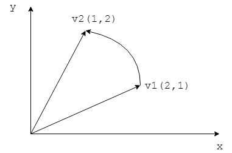
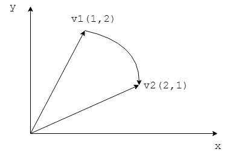

# Cross - 向量叉积

--------

#### 向量

向量$$ \vec{v} = [x, y, z] $$表示三维空间中一个有长度的方向，单位长度为$$ 1 $$。

也写作：

$$
\vec{v} = x \times \vec{i} + y \times \vec{j} + z \times \vec{k}
$$

其中$$ \vec{i}, \vec{j}, \vec{k} $$是$$ x, y, z $$三个轴上的单位向量，平面中的向量可以视为$$ z $$轴长度为$$ 0 $$的三维空间中一种特殊的向量，一般写作：

$$
\vec{v} = x \times \vec{i} + y \times \vec{j}
$$

#### 点积

向量的点积计算方式如下：

$$
\vec{v_{1}} \cdot \vec{v_{2}} = x_{1} \times x_{2} + y_{1} \times y_{2} + z_{1} \times z_{2}
$$

两个向量的点积结果是一个数字。

#### 叉积

向量的叉积计算方式如下：

$$
\vec{v_{1}} \times \vec{v_{2}} =
\begin{vmatrix}
\vec{i} &   \vec{j} &   \vec{k} \\
x_{1}   &   y_{1}   &   z_{1}   \\
x_{2}   &   y_{2}   &   z_{2}
\end{vmatrix}
$$

叉积的结果是一个向量，此向量遵循右手法则，将右手四指卷起大拇指伸出。从$$ \vec{v_{1}} $$沿着四根卷起的手指指向$$ \vec{v_{2}} $$，叉积结果向量与大拇指方向相同，与$$ \vec{v_{1}} $$和$$ \vec{v_{2}} $$所在平面垂直。

也可以写作：

$$
\vec{v_{1}} \times \vec{v_{2}} = \vec{n} \mid \vec{v_{1}} \mid \cdot \mid \vec{v_{2}} \mid sin \theta
$$

其中$$ \vec{n} $$即为右手法则中大拇指的方向向量，长度为$$ 1 $$，$$ \theta $$为从$$ \vec{v_{1}} $$转向$$ \vec{v_{2}} $$的转角（$$ 0^{\circ} \leq \theta \leq 180^{\circ} $$）。

#### 行列式计算公式

二阶行列式：

$$
\begin{vmatrix}
a   &   b   \\
c   &   d
\end{vmatrix}
= a \cdot d - b \cdot c
$$

三阶行列式：

$$
\begin{vmatrix}
a   &   b   &   c   \\
d   &   e   &   f   \\
g   &   h   &   i
\end{vmatrix}
= a \cdot e \cdot i + b \cdot f \cdot g + c \cdot d \cdot h - c \cdot e \cdot g - a \cdot f \cdot h - b \cdot d \cdot i
$$

根据上面公式可得：

三维空间中向量叉积为：

$$
\vec{v_{1}} \times \vec{v_{2}} = (y_{1} \cdot z_{2} - y_{2} \cdot z_{1}) \cdot \vec{i} - (x_{1} \cdot z_{2} - x_{2} \cdot z_{1}) \cdot \vec{j} + (x_{1} \cdot y_{2} - x_{2} \cdot y_{1}) \cdot \vec{k}
$$

二维平面中向量叉积为：

$$
\vec{v_{1}} \times \vec{v_{2}} = (x_{1} \cdot y_{2} - x_{2} y_{1}) \cdot \vec{k}
$$

#### 向量夹角

计算两个向量$$ \vec{v_{1}} $$和$$ \vec{v_{2}} $$的夹角时，我们一般将它们看作其共同的垂直方向向量长度为$$ 0 $$，叉积$$ C = \vec{v_{1}} \times \vec{v_{2}} = x_{1} \cdot y_{2} - x_{2} \cdot y_{1} $$的结果。

$$ (1) $$ 若$$ C \gt 0 $$则$$ \vec{v_{2}} $$在$$ \vec{v_{1}} $$的逆时针方向（按右手螺旋法则从$$ \vec{v_{1}}$$旋转到$$ \vec{v_{2}} $$时，大拇指与单位向量$$ \vec{k} $$方向相同）；

$$ (2) $$ 若$$ C \lt 0 $$则$$ \vec{v_{2}} $$在$$ \vec{v_{1}} $$的顺时针方向（按右手螺旋法则从$$ \vec{v_{1}}$$旋转到$$ \vec{v_{2}} $$时，大拇指与单位向量$$ \vec{k} $$方向相反）；

$$ (3) $$ 若$$ C = 0 $$则$$ \vec{v_{1}} $$与$$ \vec{v_{2}} $$共线，这属于边界情况；

需要注意叉积的正负值与向量间顺时针逆时针的关系，很容易搞混。

计算向量叉积的时间复杂度为$$ O(1) $$。

--------

#### 数学复习全书（李永乐李正元考研数学 数学一）

* https://book.douban.com/subject/21370697/

--------

#### 源码

[Cross.h](https://github.com/linrongbin16/Way-to-Algorithm/blob/master/src/AnalyticGeometry/Polygon/Cross.h)

[Cross.cpp](https://github.com/linrongbin16/Way-to-Algorithm/blob/master/src/AnalyticGeometry/Polygon/Cross.cpp)

#### 测试

[CrossTest.cpp](https://github.com/linrongbin16/Way-to-Algorithm/blob/master/src/AnalyticGeometry/Polygon/CrossTest.cpp)
