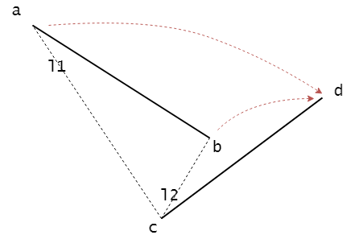
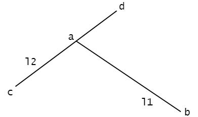

# Segment Intersecion - 线段交叉

--------

#### 问题

判断两线段$$ l_{1} $$和$$ l_{2} $$是否相交。

#### 解法

对于一条线段和一条直线，若线段两端点在直线的不同两侧则称该线段“跨越”了该直线。根据该公理，线段$$ l_{1} $$和$$ l_{2} $$相交有两种情况：

$$ (1) $$ 两条线段$$ l_{1} $$和$$ l_{2} $$，任意一条线段的两个端点都在另一线段所在直线的两侧。即$$ l_{1} $$的两端点跨越$$ l_{2} $$所在的直线，$$ l_{2} $$的两端点也跨越$$ l_{1} $$所在直线。如图所示：

对于图$$ 1 $$，$$ l_{2} $$的两端点$$ c $$和$$ d $$分别在$$ l_{1} $$所在直线的两边，且$$ l_{1} $$的两端点$$ a $$和$$ b $$分别在$$ l_{2} $$所在直线的两边，因此$$ l_{1} $$和$$ l_{2}$$相交。

设$$ \vec{ab} $$和$$ \vec{ac} $$的叉积为$$ \vec{ab-ac} $$，$$ \vec{ab} $$和$$ \vec{ad} $$的叉积为$$ \vec{ab-ad} $$，$$ \vec{cd} $$和$$ \vec{ca} $$的叉积为$$ \vec{cd-ca} $$，$$ \vec{cd} $$和$$ \vec{cb} $$的叉积为$$ \vec{cd-cb} $$。根据Cross中的转向可知，$$ \vec{ab-ac} $$、$$ \vec{ab-ad} $$两个叉积的转向相反，一正一负（表示一个方向与方向向量$$ k $$（$$ x, y, z $$平面中的$$ z $$轴）相同，另一个方向相反），$$ \vec{cd-ca} $$、$$ \vec{cd-cb} $$两个叉积的转向相反，一正一负。

对于图$$ 2 $$，$$ \vec{ab-ac} $$和$$ \vec{ab-ad} $$的叉积转向相反，但$$ \vec{cd-ca} $$和$$ \vec{cd-cb} $$的叉积转向相同，同正同负，因此图2中的两线段不相交。

$$ (2) $$ 线段$$ l_{1} $$的其中一个端点在线段$$ l_{2} $$上，这是一种边界情况，无需考虑$$ l_{1} $$的另一个端点的位置，也可以确定$$ l_{1} $$、$$ l_{2} $$相交。如图所示：

点$$ a $$在线段$$ l_{2} $$上的条件为：$$ \vec{ca} $$和$$ \vec{ad} $$两向量方向相同，即两向量的叉积值为$$ 0 $$；且点$$ a $$的$$ x, y $$坐标在线段$$ l_{2} $$的$$ x, y $$范围内。

该算法的时间复杂度为$$ O(1) $$。

--------

#### Introduction to Algorithms

* [VII.Selected Topics - 33.Computational Geometry - 33.2.Determining whether any pair of segments intersects](https://www.google.com/search?q=Introduction+to+Algorithms+3rd+Edition+pdf)

--------

#### 源码

[SegmentIntersection.h](https://github.com/linrongbin16/Way-to-Algorithm/blob/master/src/AnalyticGeometry/Polygon/SegmentIntersection.h)

[SegmentIntersection.cpp](https://github.com/linrongbin16/Way-to-Algorithm/blob/master/src/AnalyticGeometry/Polygon/SegmentIntersection.cpp)

#### 测试

[SegmentIntersectionTest.cpp](https://github.com/linrongbin16/Way-to-Algorithm/blob/master/src/AnalyticGeometry/Polygon/SegmentIntersectionTest.cpp)
