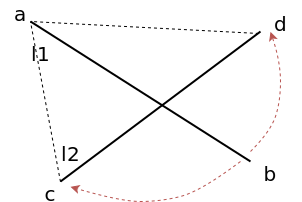
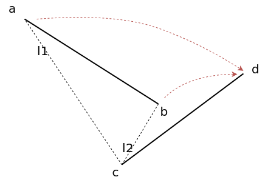

# Segment Intersecion - 线段交叉

--------

#### 问题

判断两线段$$ l_{1} $$和$$ l_{2} $$是否相交。

#### 解法

对于一条线段和一条直线，若线段两端点在直线的不同两侧则称该线段“跨越”了该直线。

设$$ l_{1} $$两端点为$$ a $$和$$ b $$，$$ l_{2} $$两端点为$$ c $$和$$ d $$。

根据上述公理，线段$$ l_{1} $$和$$ l_{2} $$相交，满足下面两条件中其一即可（同时满足也可）：

$$ (1) $$ 两条线段$$ l_{1} $$和$$ l_{2} $$，任意一条线段的两个端点都在另一线段所在直线的两侧。即$$ l_{1} $$的两端点跨越$$ l_{2} $$所在的直线，$$ l_{2} $$的两端点也跨越$$ l_{1} $$所在直线。如图所示：

因为$$ \vec{ab} $$到$$ \vec{ac} $$的转向，$$ \vec{ab} $$到$$ \vec{ad} $$的转向，一个是顺时针，一个是逆时针。

即向量$$ \vec{ab} $$和$$ \vec{ac} $$的叉积与$$ \vec{ab} $$和$$ \vec{ad} $$的叉积的正负号相反。

$$ (2) $$ 线段$$ l_{1} $$的端点$$ a $$在线段$$ l_{2} $$上，另一端点$$ b $$不在线段$$ l_{3} $$上，这种是边界情况。如图所示：

若线段$$ l_{1} $$的端点$$ b $$在线段$$ l_{2} $$所在的直线上，则称这两个线段相交。

--------

#### 算法导论-第33章计算几何学-第2节

* https://book.douban.com/subject/20432061/
* http://open.163.com/special/opencourse/algorithms.html

--------

#### 源码

[import, lang:"c_cpp"](../../../../src/AnalyticGeometry/Util.h)

[import, lang:"c_cpp"](../../../../src/AnalyticGeometry/Polygon/SegmentIntersection.h)

#### 测试

[import, lang:"c_cpp"](../../../../src/AnalyticGeometry/Polygon/SegmentIntersection.cpp)
