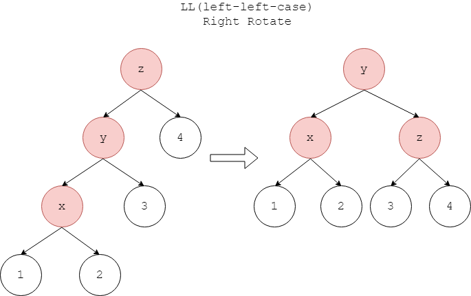
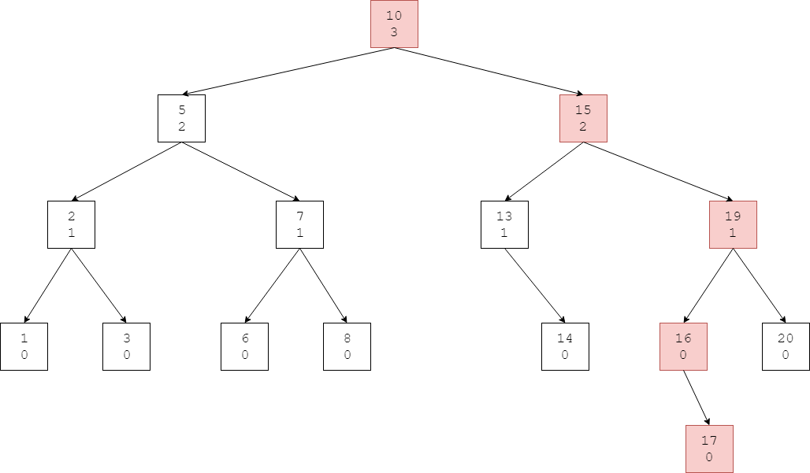
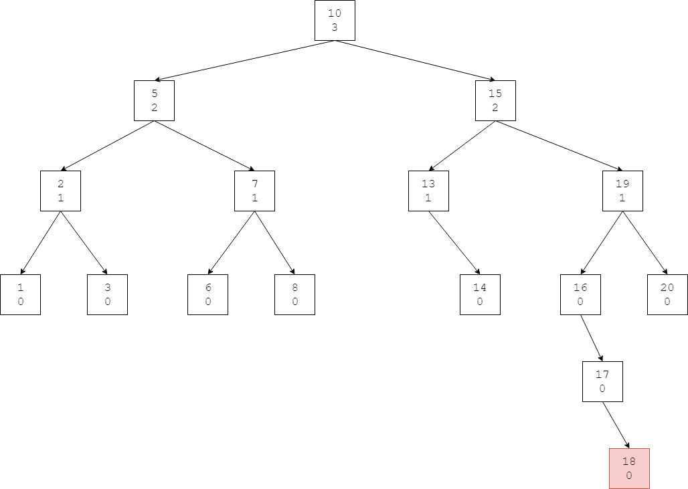
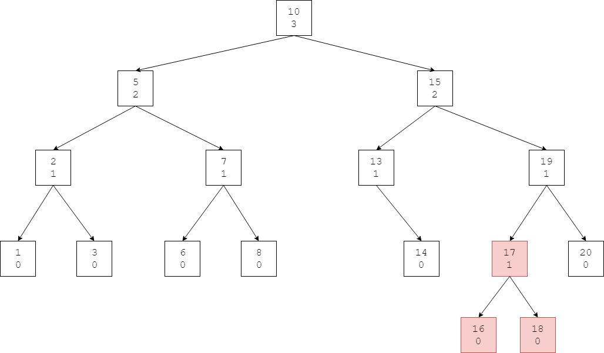
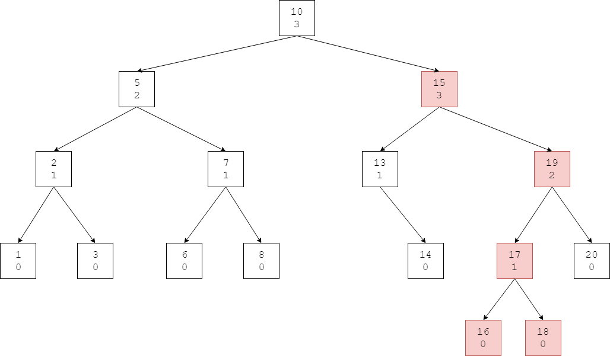
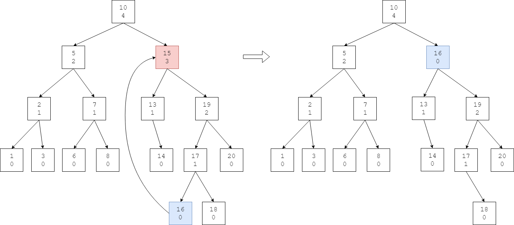

# AVL Tree - AVL二叉树

--------

#### AVL二叉平衡树

AVL树是最早发明的一种自平衡二叉查找树，树中的任何节点的左右两个子树的高度最大差别为$$ 1 $$，因此也称为高度平衡树。包含$$ n $$个节点的AVL树其查找、插入、删除操作的平均时间复杂度都是$$ O(log_{2}⁡n) $$。AVL树高度为$$ O(log_{2}⁡n) $$。

引入二叉树上节点之间距离和高度的定义。一个叶子节点向上到达根节点所经过的跳数为这两个节点的距离，一个节点和自己的距离为$$ 0 $$，将空节点的高度视作$$ -1 $$。根节点到达其所有叶子节点的最大距离即为根节点的高度，同时也是该子树的高度。显然对于任意节点都有：

$$
height_{x} = max(height_{left}, height_{right}) + 1
$$

一个节点的左右孩子的高度差为该节点的平衡因子：

$$
factor = height_{left} - height_{right} 
$$

当一个节点的$$ \lvert factor \rvert \leq 1 $$时称该节点所在的子树是平衡的，否则是不平衡的。

除了基本的二叉查找树属性，AVL树拥有以下属性：

$$ (1) $$ AVL树上所有节点都是平衡的，即平衡性；

AVL树的查询操作和二叉查找树一样，插入/删除操作也基本相同，首先通过二分查找找到合适插入的位置/要被删除的节点，然后做插入/删除操作。插入/删除会破坏AVL树的平衡性，通过LL（单向右旋平衡处理/左左）、RR（单向左旋平衡处理/右右）、LR（先左后右双向旋转平衡处理/左右）、RL（先右后左双向旋转平衡处理/右左）四种操作来保持金字塔形状：

上面四种情况包含了所有从不平衡转化为平衡。通过节点的高度值、该节点是其父结点的左或者右，可以判断节点属于哪种情况，做相应的操作。

对于下面这个AVL树，每个节点中上面的数字是节点下标，下面的数字是该节点的高度值$$ height $$。将$$ 18 $$从该AVL树的根节点开始，按照二分查找算法依次经过节点$$ 10 \rightarrow 15 \rightarrow 19 \rightarrow 16 \rightarrow 17 $$，最后插入$$ 17 $$的右孩子节点；

新节点插入完成后，我们沿着父结点指针一路向上，检查每个节点是否平衡，若不平衡则进行旋转操作，再更新节点高度，直到根节点。

$$ (1) $$ 节点$$ 18 $$为叶子节点，因此高度值为$$ height_{18} = 0 $$；

$$ (2) $$ 平衡因子为$$ factor_{17} = \lvert height_{nil} - height_{18} \rvert = \lvert - 1 - 0 \rvert = 1 $$，不需要旋转，更新节点$$ 17 $$的高度值$$ height_{17} = max⁡(height_{nil},height_{nil}) + 1 = max⁡(-1,0) + 1 = 1 $$；

$$ (3) $$ 平衡因子为$$ factor_{16} = \lvert height_{nil} - height_{17} \rvert = \lvert - 1 - 1 \rvert = 2 \gt 1 $$，需要进行RR操作，旋转后节点$$ 16 $$的高度值为$$ height_{16} = 0 $$，更新节点$$ 16 $$的高度值$$ height_{16} = max⁡(height_{nil},height_{17}) + 1 = max⁡(-1,1) + 1 = 2 $$；

$$ (4) $$ 平衡因子为$$ factor_{19} = \lvert height_{17} - height_{20} \rvert = \lvert 1 - 0 \rvert = 1 $$，更新节点$$ 19 $$的高度值$$ height_{19} = max⁡(height_{16},height_{20}) + 1 = max⁡(1,0) + 1 = 2 $$；

$$ (5) $$ 平衡因子为$$ factor_{15} = \lvert height_{13} - height_{19} \rvert = \lvert 1 - 2 \rvert = 1 $$，更新节点$$ 15 $$的高度值$$ height_{15} = max⁡(height_{13},height_{19}) + 1 = max⁡(1,2) + 1 = 3 $$；

$$ (6) $$ 平衡因子为$$ factor_{10} = \lvert height_{5} - height_{15} \rvert = \lvert 2 - 3 \rvert = 1 $$，更新节点$$ 10 $$的高度值$$ height_{10} = max⁡(height_{5},height_{15}) + 1 = max⁡(2,3) + 1 = 4 $$；

AVL树的删除操作和BinarySearchTree一样，对于节点$$ x $$有以下三种情况：

$$ (1) $$ 若$$ x $$为叶子节点，既没有左孩子节点也没有右孩子节点，直接删除；

$$ (2) $$ 若$$ x $$只有一个孩子节点$$ y $$，则像链表一样将$$ x $$从其父节点和$$ y $$之间删除；

$$ (3) $$ 若$$ x $$同时有左右孩子节点，按照中序遍历找出二叉树中比$$ x $$大的下一个节点$$ next $$（中序遍历下的后继节点），用其值代替$$ x $$，实际删除节点$$ next $$；

删除完成后从$$ x $$的父节点开始依次向上，检查每个节点是否平衡，若不平衡则进行旋转操作，再更新节点高度，直到根节点。下图中删除节点$$ 15 $$，节点$$ 15 $$的中序遍历后继节点$$ 16 $$代替它，然后删除真正的$$ 16 $$。从新的$$ 16 $$开始检查每个节点是否平衡，直到根节点。本次删除结束。

--------

#### 源码

[AvlTree.h](https://github.com/linrongbin16/Way-to-Algorithm/blob/master/src/DataStructure/AvlTree.h)

[AvlTree.cpp](https://github.com/linrongbin16/Way-to-Algorithm/blob/master/src/DataStructure/AvlTree.cpp)

#### 测试

[AvlTreeTest.cpp](https://github.com/linrongbin16/Way-to-Algorithm/blob/master/src/DataStructure/AvlTreeTest.cpp)
