

# Leftist Tree(Leftist Heap) - 左偏树（左倾堆）

--------

#### 左偏树

左偏树是一种类似小根堆的二叉树，它的根节点总是树中的最小值。左偏树的每次取出/加入操作的时间复杂度为$$ O(log_2 n) $$，与小根堆相同。与堆不同的是，合并两个数量为$$ n $$的堆的时间复杂度为$$ O(n \times log_2 n) $$（因为合并两个堆需要从其中一个取出元素加入另一个，重复$$ n $$次），而合并两个数量为$$ n $$的左偏树的时间复杂度为$$ O(log_2 n) $$。

左偏树的主要操作有：$$ (1) $$ 合并两个左偏树；$$ (2) $$ 插入新节点；$$ (3) $$ 查找最值；$$ (4) $$ 删除最值。其中$$ (2) - (4) $$的实现依赖于$$ (1) $$，合并操作是左偏树的核心。

左偏树中的节点的距离$$ d $$是该节点到最右下叶子节点的距离。左偏树具有以下性质：

$$ (1) $$ 父节点的值小于等于其左右孩子节点的值，即$$ value_{father} \leq value_{left}, value_{father} \leq value_{right} $$。最小的值在根节点类似小根堆的头节点；

$$ (2) $$ 父节点的左孩子节点的距离大于等于右孩子节点的距离，即$$ d_{left} \geq d_{right} $$；

$$ (3) $$ 父节点的距离等于其右孩子节点的距离加$$ 1 $$，即$$ d_{father} = d_{right} + 1 $$；

$$ (4) $$ 具有$$ n $$个节点的左偏树的根节点的距离小于等于$$ log_2⁡(n+1) - 1 $$，即$$ d_{root} \leq log_2⁡(n+1) - 1 $$；

下图中每个节点上，上面的数字代表节点的值，下面的数字代表距离。合并两个左偏树的操作，分为两步：

$$ (1) $$ 递归向下合并子树的根节点，合并两个左偏树，每次合并时比较两个子树根节点的值$$ value_{a} $$和$$ value_{b} $$，总是用根节点较大的子树$$ value_{b} $$（设$$ value_{b} \gt value_{a} $$）替换根节点较小的子树$$ value_{a} $$的右孩子节点$$ value_{a-left} $$，替换后$$ value_{a-left} $$成为新的子树。然后递归的，继续考虑$$ value_{a-left} $$作为根节点的子树与$$ value_{b} $$作为根节点的子树；

$$ (2) $$ 递归向上更新所有被修改过的节点的距离；

下图是合并两个左偏树的过程：

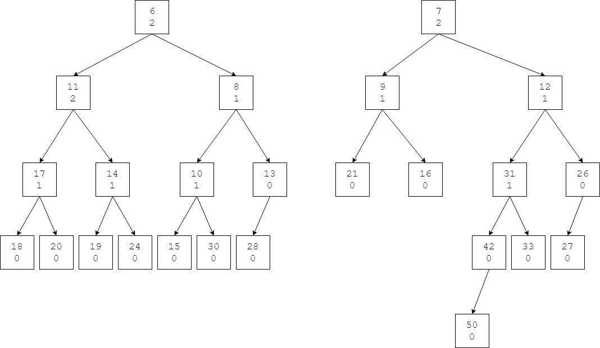

$$ (1) $$ 比较两树的根节点$$ 6 \lt 7 $$，节点$$ 7 $$沿着节点$$ 6 $$向右下寻找第$$ 1 $$个满足$$ 7 \lt x $$的节点$$ x $$，替换$$ x $$作为节点$$ 6 $$的新右孩子节点。该节点为节点$$ 8 $$（$$ 7 \lt 8 $$），节点$$ 6 $$的原右孩子节点$$ 8 $$暂时脱离；

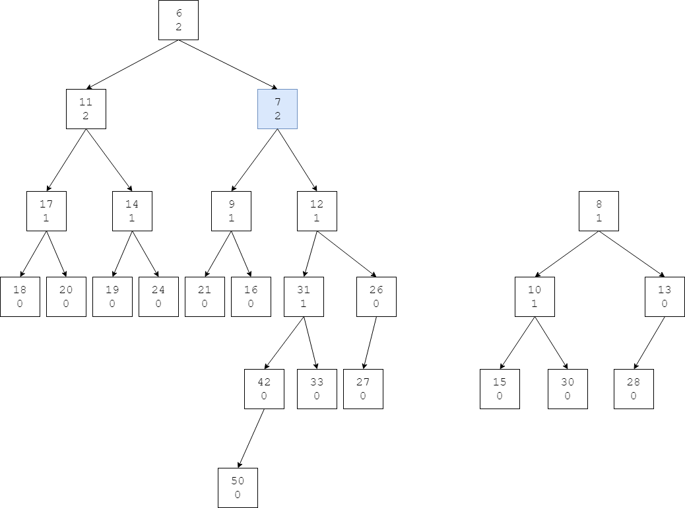

$$ (2) $$ 节点$$ 8 $$沿着节点$$ 7 $$向右下寻找第$$ 1 $$个满足$$ 8 \lt x $$的节点$$ x $$，替换$$ x $$作为节点$$ 7 $$的新右孩子节点。该节点为节点$$ 12 $$（$$ 8 \lt 12 $$），节点$$ 7 $$的原右孩子节点$$ 12 $$暂时脱离；

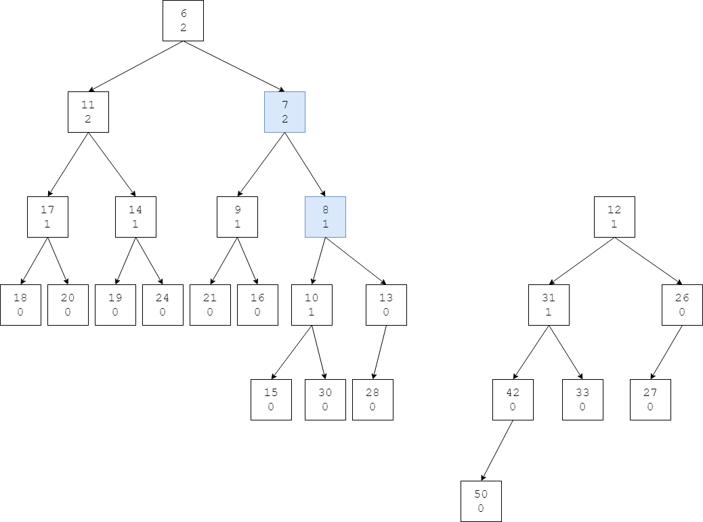

$$ (3) $$ 节点$$ 12 $$沿着节点$$ 8 $$向右下寻找第$$ 1 $$个满足$$ 12 \lt x $$的节点$$ x $$，替换$$ x $$作为节点$$ 8 $$的新右孩子节点。该节点为节点$$ 13 $$（$$ 12 \lt 13 $$），节点$$ 8 $$的原右孩子节点$$ 13 $$暂时脱离；

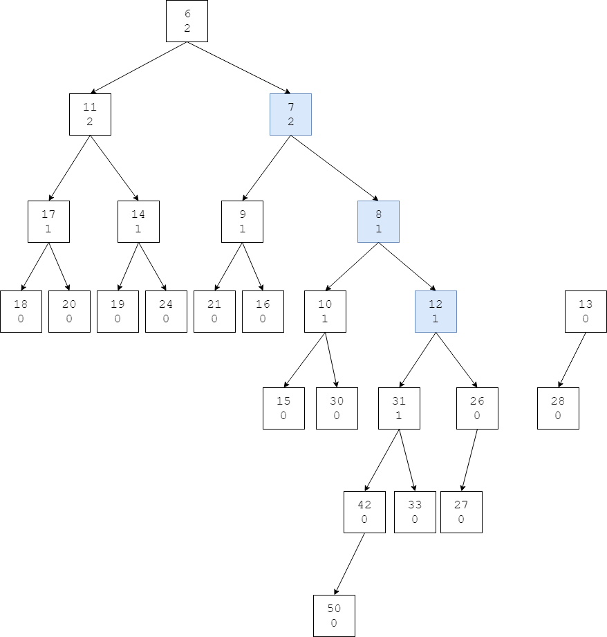

$$ (4) $$ 节点$$ 13 $$沿着节点$$ 12 $$向右下寻找第$$ 1 $$个满足$$ 13 \lt x $$的节点$$ x $$，替换$$ x $$作为节点$$ 12 $$的新右孩子节点。该节点为节点$$ 26 $$（$$ 13 \lt 26 $$），节点$$ 12 $$的原右孩子节点$$ 26 $$暂时脱离；

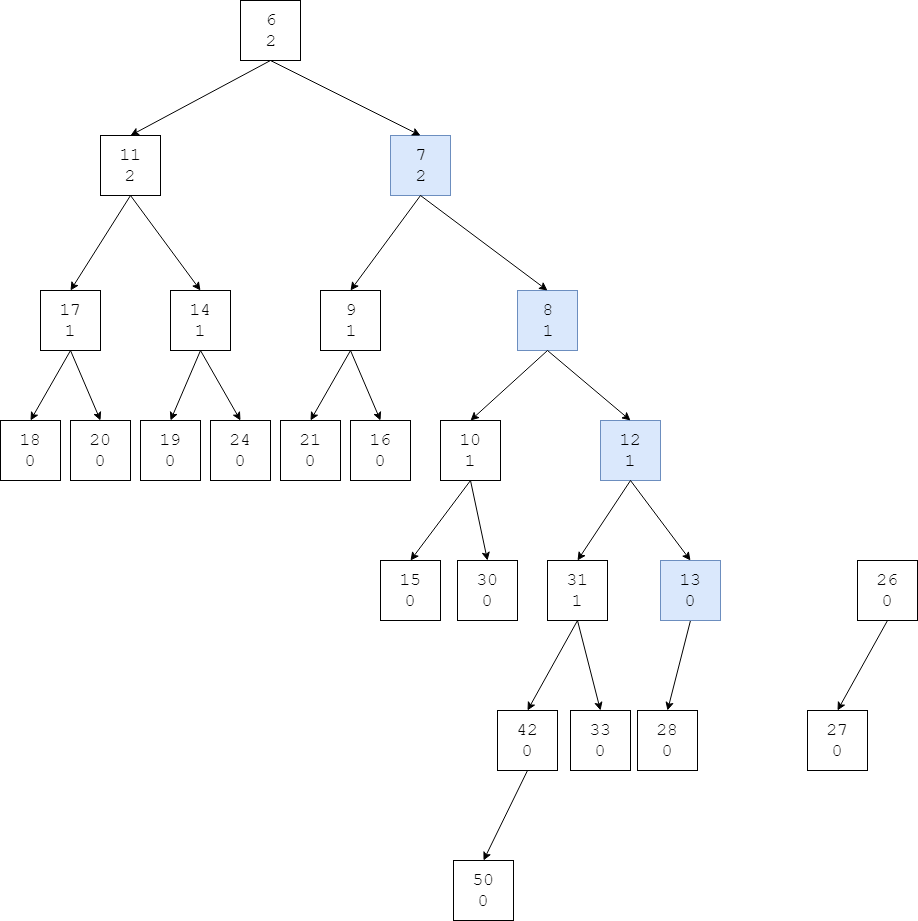

$$ (5) $$ 节点$$ 26 $$沿着节点$$ 13 $$向右下寻找第$$ 1 $$个满足$$ 26 \lt x $$的节点$$ x $$，节点$$ 13 $$没有右孩子节点，因此节点$$ 26 $$直接成为节点$$ 13 $$的右孩子节点，不再需要替换，合并操作结束；

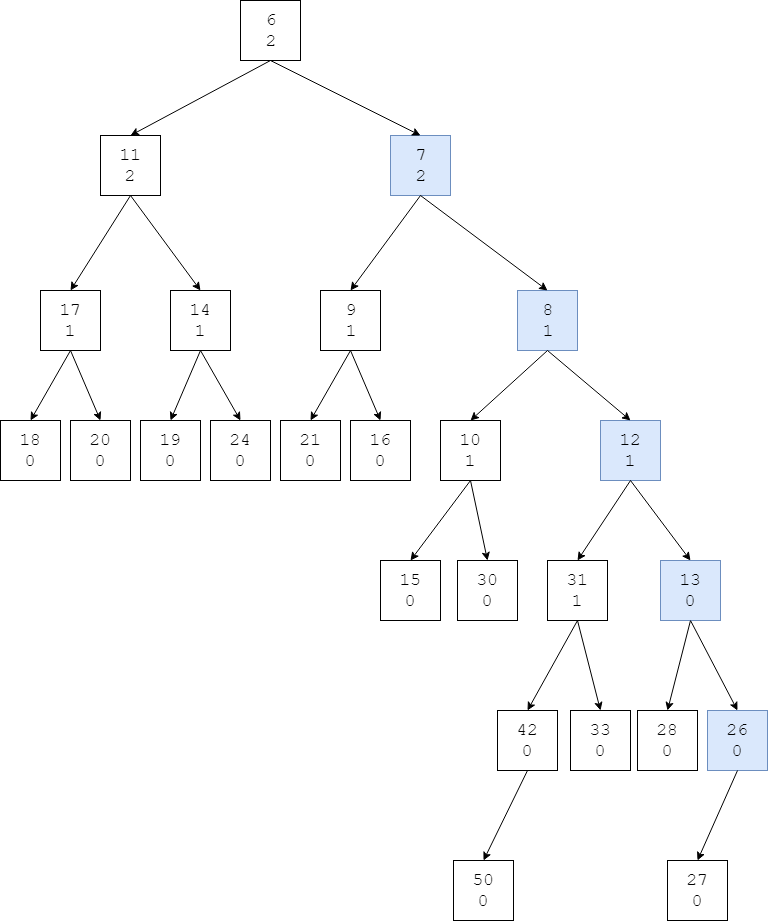

向右下插入节点的操作会影响到左偏树的平衡性，右子树变得越来越庞大。而且所有节点的距离也是错的（没有更新）。实际上每一步合并操作后还需要检查左右子树的距离属性：$$ (1) $$对于$$ d_{left} \lt d_{right} $$的情况，交换左右子树；$$ (2) $$对于$$ d_{root} \neq d_{right} + 1 $$的情况，更新$$ d_{root} $$。

节点距离的更新必须从叶子节点开始向上进行，对于之前步骤中修改过的节点，重新遍历计算其距离（其中$$ d_{nil} = -1 $$）：

$$ (6) $$ 对于节点$$ 26 $$，$$ d_{27} = 0 \ge d_{nil} = - 1 $$，不需要交换左右子树，更新$$ d_{26} = d_{nil} + 1 = - 1 + 1 = 0 $$；

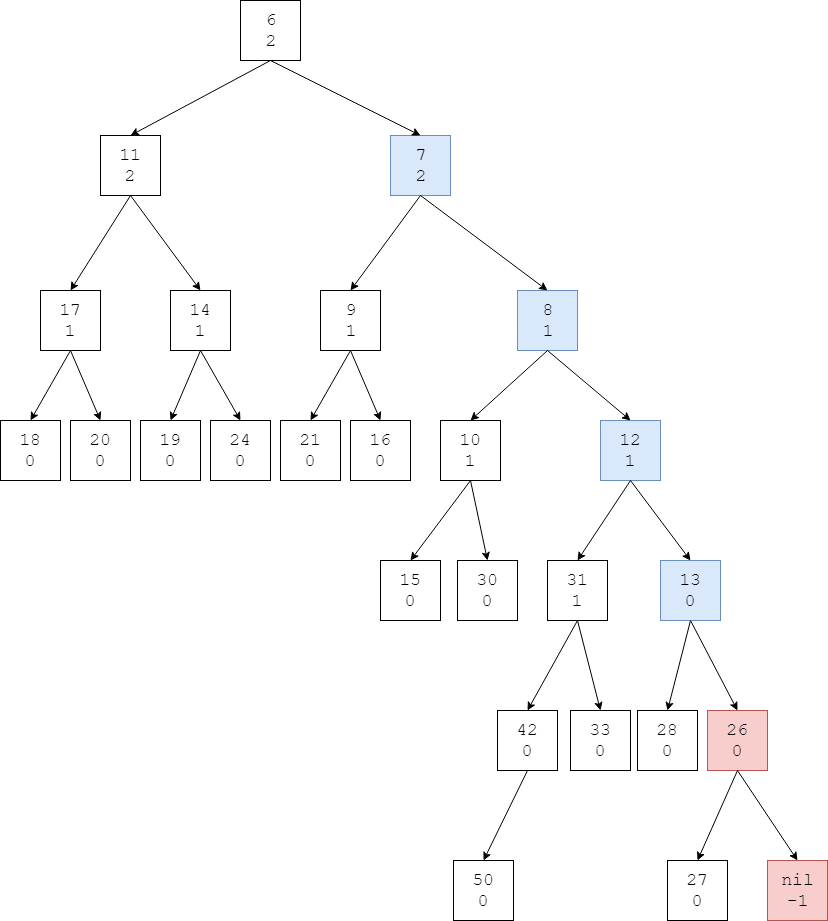

$$ (7) $$ 对于节点$$ 13 $$，$$ d_{28} = 0 \ge d_{26} = 0 $$，不需要交换左右子树，更新$$ d_{13} = d_{26} + 1 = 0 + 1 = 1 $$；

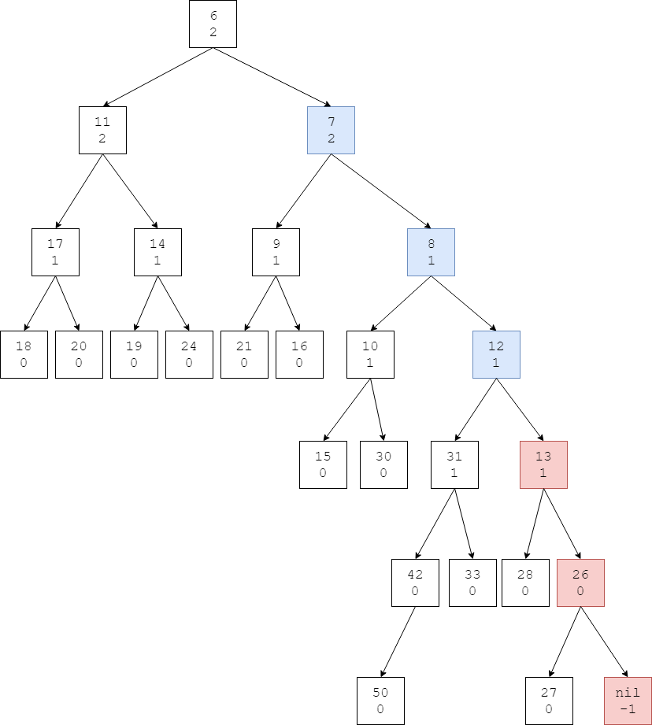

$$ (8) $$ 对于节点$$ 12 $$，$$ d_{31} = 1 \ge d_{26} = 1 $$，不需要交换左右子树，更新$$ d_{12} = d_{13} + 1 = 1 + 1 = 2 $$；

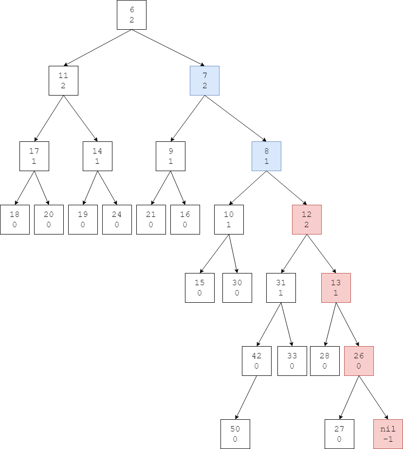

$$ (9) $$ 对于节点$$ 8 $$，$$ d_{10} = 1 \lt d_{12} = 2 $$，需要交换子树$$ 10 $$和子树$$ 12 $$，更新$$ d_{8} = d_{10} + 1 = 1 + 1 = 2 $$；

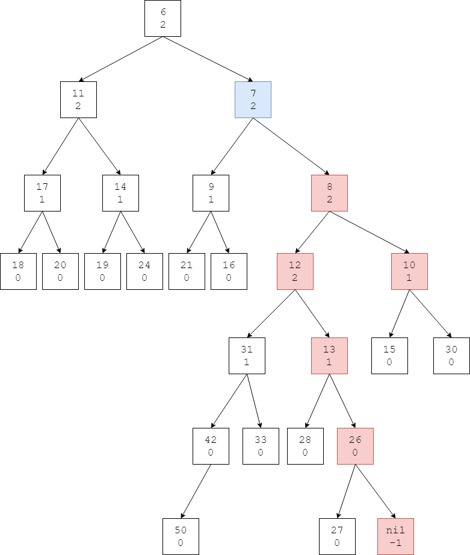

$$ (10) $$ 对于节点$$ 7 $$，$$ d_{9} = 1 \lt d_{8} = 2 $$，需要交换子树$$ 9 $$和子树$$ 8 $$，更新$$ d_{7} = d_{9} + 1 = 1 + 1 = 2 $$；

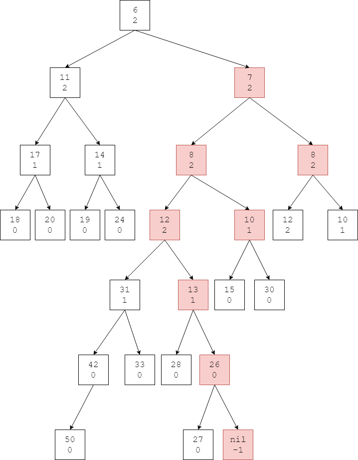

$$ (11) $$对于节点$$ 6 $$，$$ d_{11} = 2 \ge d_{7} = 2 $$，不需要交换左右子树，更新$$ d_{6} = d_{7} + 1 = 2 + 1 = 3 $$；

编码时通过递归的方式将合并和更新距离两个操作放在同一个递归函数中，合并函数Merge返回合并后左偏树的根节点的距离$$ d $$，在Merge中调用左右孩子的合并操作，获取左右孩子的距离，然后再决定是否交换左右子树，并更新父节点的距离。本文的将两个步骤分开是为了方便理解算法。

左偏树的插入操作，可以看作左偏树与一个只有根节点的左偏树的合并操作；删除最值的操作，可以看作删除根节点后，合并左右子树的操作。

左偏树的合并操作、插入节点操作、删除根节点操作的时间复杂度都为$$ O(log_2⁡n) $$。

--------

#### 源码

[LeftistTree.h](https://github.com/linrongbin16/Way-to-Algorithm/blob/master/src/DataStructure/LeftistTree.h)

[LeftistTree.cpp](https://github.com/linrongbin16/Way-to-Algorithm/blob/master/src/DataStructure/LeftistTree.cpp)

#### 测试

[LeftistTreeTest.cpp](https://github.com/linrongbin16/Way-to-Algorithm/blob/master/src/DataStructure/LeftistTreeTest.cpp)
