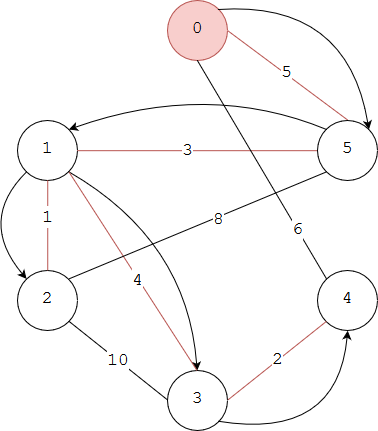

# Prim - Prim 算法

--------

#### 问题

用Prim算法求无向图$$ UG $$的最小生成树。

#### 解法

Prim算法是一种贪心算法，按照以下步骤操作：

$$ (1) $$ 初始时设生成树为空，边集合为$$ E_{tree} = \varnothing $$，点集合为$$ V_{tree} = \varnothing $$。将任意顶点$$ v_0 $$作为初始顶点加入生成树的点集合中，得到$$ V_{tree} = [ v_0 ] $$；

$$ (2) $$ 在$$ V_{tree} $$的所有临边（生成树的临边$$ e_{i,j} $$是一个顶点属于生成树$$ v_i \in V_{tree} $$，另一个顶点不属于生成树$$ v_j \notin V_{tree} $$的边）中找到权值最小的临边$$ e_{i,j} $$。设边$$ e_{i,j} $$中$$ v_i \in V_{tree} $$，$$ v_j \notin V_{tree} $$，将该边加入生成树中：将顶点$$ v_j $$加入生成树点集合$$ V_{tree} $$，将边$$ e_{i,j} $$加入生成树边集合$$ E_{tree} $$；

重复上述操作，直到$$ V_{tree} = V $$为止，算法结束。这时$$ E_{tree} $$即为无向图$$ UG $$的最小生成树。

上图演示了无向图使用Prim算法求最小生成树的过程，从顶点$$ 0 $$开始。需要注意每次选择新的边时，是从$$ V_{tree} $$的所有顶点的临边中选择，不是仅仅从最近一个访问的顶点的临边中选取。

Prim算法的时间复杂度为$$ O(\| V \| \cdot log_2 \| V \|) $$，其中$$ log_2 \| V \| $$表示平均每个顶点的邻节点数量。

--------

#### Introduction To Algorithms

* [VI.Graph Algorithms - 23.Minimum Spanning Trees - 23.2.The algorithms of Kruskal and Prim](https://www.google.com/search?q=Introduction+to+Algorithms+3rd+Edition+pdf)

--------

#### 源码

[Prim.h](https://github.com/linrongbin16/Way-to-Algorithm/blob/master/src/GraphTheory/MinSpanningTree/Prim.h)

[Prim.cpp](https://github.com/linrongbin16/Way-to-Algorithm/blob/master/src/GraphTheory/MinSpanningTree/Prim.cpp)

#### 测试

[PrimTest.cpp](https://github.com/linrongbin16/Way-to-Algorithm/blob/master/src/GraphTheory/MinSpanningTree/PrimTest.cpp)
