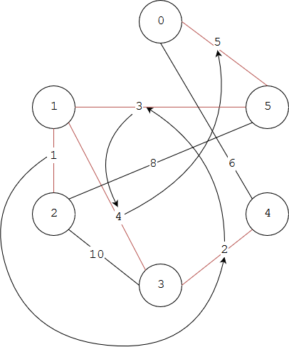

# Prim - Prim 算法

--------

#### 问题

用Prim算法求无向图$$ UG $$的最小生成树。

#### 解法

Prim算法是贪心算法的应用：

$$ (1) $$ 初始时设生成树的边集合为$$ E_{tree} $$，点集合为$$ V_{tree} $$（初始时生成树为空）。将一个顶点作为初始顶点加入生成树的点集$$ V_{tree} $$中；

$$ (2) $$ 类似BFS算法，在$$ V_{tree} $$的所有临边（一个端点属于$$ V_{tree} $$，另一个端点不属于的边）中找到权值最小的临边$$ e_{i,j} $$。设边$$ e_{i,j} $$属于$$ V_{tree} $$的端点为$$ v_i $$，不属于$$ V_{tree} $$的端点为$$ v_j $$。将该边加入生成树中：将顶点$$ v_j $$加入生成树点集$$ V_{tree} $$，将边$$ e_{i,j} $$加入生成树边集$$ E_{tree} $$；

重复上述操作，直到$$ V_{tree} = V $$为止，这时$$ E_{tree} $$即为无向图$$ UG $$的最小生成树。

上图演示了无向图使用Prim算法求最小生成树的过程，从顶点$$ 0 $$开始。需要注意，每次选择新的边时，是从所有当前生成树顶点的临边中选择，而不仅仅从最后一个加入的顶点临边中选取。无向图选择边$$ e_{1,3} $$，因为当时生成树的点集为$$ V_{tree} = [0, 5, 1, 2] $$，点集$$ V_{tree} $$的所有临边中$$ e_{1,3} $$的权值$$ 4 $$最小。

Prim算法的时间复杂度为$$ O(|V| \cdot log_2 |V|) $$，其中$$ log_2 |V| $$表示平均每个顶点的临边（邻节点）数量。

--------

#### Introduction To Algorithms

* [VI.Graph Algorithms - 23.Minimum Spanning Trees - 23.2.The algorithms of Kruskal and Prim](https://mcdtu.files.wordpress.com/2017/03/introduction-to-algorithms-3rd-edition-sep-2010.pdf)

--------

#### 源码

[Prim.h](https://github.com/linrongbin16/Way-to-Algorithm/blob/master/src/GraphTheory/MinSpanningTree/Prim.h)

[Prim.cpp](https://github.com/linrongbin16/Way-to-Algorithm/blob/master/src/GraphTheory/MinSpanningTree/Prim.cpp)

#### 测试

[PrimTest.cpp](https://github.com/linrongbin16/Way-to-Algorithm/blob/master/src/GraphTheory/MinSpanningTree/PrimTest.cpp)

