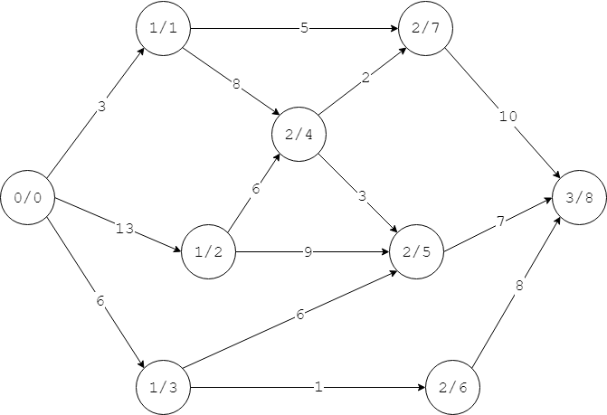

# Dinic - Dinic算法（距离标号算法）

--------

#### 问题

用Dinic算法（也称为距离标号算法）求网络流$$ G $$的最大流，$$ G = <V,E> $$是单源点、单汇点，边的容量为正整数。

#### 解法

Dinic算法也属于Ford–Fulkerson方法的一种实现，与Edmonds-Karp算法的区别在于增广路径的搜索方式不同。Dinic算法结合了BFS和DFS两种搜索来寻找增广路径，设计出水位图（Level Graph）/距离标号（Distance Label）来管理。

水位图（Level Graph）/距离图（Distance Graph）：从网络的源点（$$ s $$）出发进行BFS搜索，源点的水位/距离为$$ dist = 0 $$，每个节点根据BFS搜索到的邻节点的水位/距离在该节点的基础上加$$ 1 $$且都相等，即$$ dist(j) = dist(i) + 1 $$（设节点$$ v_j $$是节点$$ v_i $$的BFS搜索的邻节点）。下图演示一个网络的距离图，每个节点上前一个数字为该节点的距离，后一个数字为该节点的下标：

阻塞流（Blocking Flow）：从源点$$ s $$到汇点$$ t $$，上面所有的相邻节点$$ v_i, v_j $$的边$$ e_{i,j} $$可以容纳额外的流$$ c(i,j) \gt f(i,j) $$，且水位差满足$$ dist(i) + 1 = dist(j) $$的。

Dinic算法的步骤如下：

$$ (1) $$ 初始化所有节点之间的流为$$ 0 $$，即$$ f(i,j) = f(j,i) = 0 $$（节点$$ v_i, v_j $$为相邻节点）；

$$ (2) $$ 通过BFS构建距离标号；

$$ (3) $$ 在网络中寻找一个阻塞流作为增广路径，在该流的所有边中选择剩余容量$$ c(i,j) - f(i,j) $$最小的（其中$$ v_i, v_j $$是相邻节点，选择最小值的原理类似木桶短板原理），即有

$$
\Delta = min\{ c(i,j) - f(i,j) \}
$$

故该增广路径上所有边的流更新为

$$
f(i,j) += \Delta
$$

该网络的最大流更新为

$$
flow += min\{ c(i,j) - f(i,j) \}
$$

--------

#### Dinic Algorithm

* http://101.96.10.64/www.cse.unt.edu/~tarau/teaching/AnAlgo/Dinic's%20algorithm.pdf

--------

#### 源码

[Dinic.h](https://github.com/linrongbin16/Way-to-Algorithm/blob/master/src/GraphTheory/NetworkFlow/Dinic.h)

[Dinic.cpp](https://github.com/linrongbin16/Way-to-Algorithm/blob/master/src/GraphTheory/NetworkFlow/Dinic.cpp)

#### 测试

[DinicTest.cpp](https://github.com/linrongbin16/Way-to-Algorithm/blob/master/src/GraphTheory/NetworkFlow/DinicTest.cpp)
