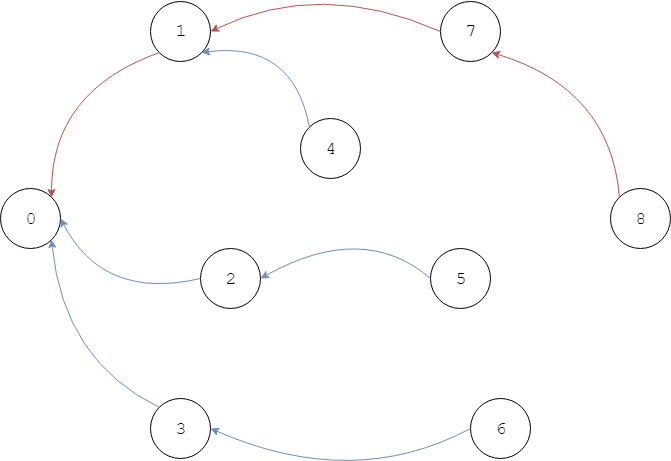
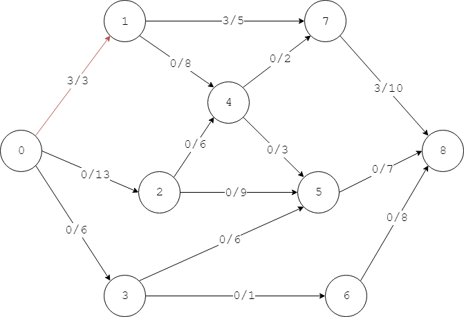

# Edmonds Karp - Edmonds Karp算法（最短路径增广算法）

--------

#### 问题

用Edmond Karp算法求网络$$ G = <V,E> $$的最大流，$$ G $$是单源点、单汇点，边的容量都为正整数的网络。

#### Ford–Fulkerson方法

Ford-Fulkerson方法是用于求解最大流的方法（并非算法），它通过寻找增广路径（Argumenting Path）来求最大流，但具体寻找的方法有多种算法实现。

网络流中边$$ e_{u,v} $$的剩余容量（Residual Capacity）是：

$$
c_f (u,v) = c(u,v) - f(u,v)
$$

边的剩余容量定义了剩余网络（Residual Network）$$ G_f = <V, E_f>  $$，表示该网络的可用容量。

网络中的增广路径是剩余网络中的一条路径$$ p = [v_1, v_2, \dots, v_n] $$，其中$$ v_1 $$是源点$$ s $$，$$ v_n $$是汇点$$ t $$，且其中每条边$$ e_{i,j} $$（两端点为$$ v_i, v_j $$）的剩余容量都满足$$ c_f(i,j) \gt 0 $$，其中$$ i, j \in [1, n] $$。

Ford-Fulkerson方法的主要过程如下：

$$ (1) $$ 初始时将网络$$ G $$看作一个未被使用的原始剩余网络，该网络的最大流初始化为$$ flow_{max} = 0 $$；

$$ (2) $$ 尝试从当前剩余网络中找到一条增广路径，该路径经过的所有边的最小的剩余容量$$ \Delta = min \{ c(i,j) - f(i,j) \} $$即为这条流可用的容量（类似木桶短板原理）。这条增广路径使最大流的值增大为

$$
flow_{max} += \Delta
$$

更新该路径上每条边$$ e_{i,j} $$的剩余容量（满足反对称性）

$$
\begin{matrix}
f(i,j) += \Delta        \\
f(j,i) -= \Delta        \\
c_f(i,j) -= \Delta      \\
c_f(j,i) += \Delta
\end{matrix}
$$

$$ (3) $$ 重复第$$ (2) $$步直到无法找出更多的增广路径，算法结束。$$ flow_{max} $$为该网络的最大流；

#### Edmonds-Karp算法

Edmonds-Karp算法是Ford-Fulkerson方法的一种经典实现。通过BFS算法找出一条增广路径从源点$$ s $$到达汇点$$ t $$。

设$$ c(i,j) $$表示节点$$ v_i $$到$$ v_j $$的边$$ e_{i,j} $$的容量，$$ c_f(i,j) $$表示边$$ e_{i,j} $$的剩余容量，逆向指针$$ from(j) = i $$表示BFS搜索中从节点$$ v_i $$搜索到邻节点$$ v_j $$（或者说节点$$ v_j $$是从节点$$ v_i $$来的）。按照以下步骤进行BFS搜索增广路径：

$$ (1) $$ 初始时设置空队列$$ queue $$，设置任意节点$$ v_i $$的$$ from(i) = nil $$（表示BFS搜索未开始），最大流$$ flow_{max} = 0 $$，所有边的容量与其剩余容量相等$$ c(i,j) = c_f(i,j) $$，边上的流为$$ f(i,j) = f(j,i) = 0 $$，将源点$$ s $$加入队列中并染红；

$$ (2) $$ 当$$ queue $$不为空时，从中取出头节点$$ v_i $$，若$$ v_i = t $$则已经找到一条增广路径；若$$ v_i \neq t $$则遍历其所有邻节点找出所有的未被染红且剩余容量$$ c_f(i,j) \gt 0 $$的邻节点$$ v_j $$（在剩余网络中进行BFS搜索），将其加入队列$$ queue $$中，染红，并设置逆向指针$$ from(j) = i $$。这样重复，若最终搜索到汇点$$ t $$则找到一条增广路径，沿着逆向指针可以得到该增广路径上的所有边；若直到队列$$ queue $$为空也没有搜索到汇点$$ t $$则说明无法再找到更多的增广路径；

$$ (3) $$ 重复第$$ (2) $$步，每找到一条增广路径，该路径中边的最小剩余容量$$ \Delta = min \{ c(i,j) - f(i,j) \} $$即为该增广路径可用的流（Dinic算法中称为阻塞流$$ Blocking Flow $$，即路径中的瓶颈）。更新该路径上所有边的剩余容量：

$$
\begin{matrix}
f(i,j) += \Delta        \\
f(j,i) -= \Delta        \\
c_f(i,j) -= \Delta      \\
c_f(j,i) += \Delta
\end{matrix}
$$

更新最大流

$$ flow_{max} += \Delta $$

当无法找出更多增广路径时算法结束，$$ flow_{max} $$即为该网络的最大流；

下图演示了一条增广路径的搜索过程，其中源点为$$ 0 $$汇点为$$ 8 $$：

上图中的红线是BFS搜索剩余网络中节点的顺序，蓝线是从汇点沿着逆向指针回到源点的路径。

上图是本次BFS搜索的逆向指针。可得增广路径为$$ [0, 1, 7, 8] $$，其中边$$ e_{0,1} = 3 $$是剩余容量最小的边，此条增广路径可用的流为$$ 3 $$。

然后对该增广路径上的所有边更新剩余容量，下图中每条边上的数字$$ x / y $$表示边上的流为$$ x $$，边的容量为$$ y $$，剩余容量为$$ y - x $$，其中标记为红色的边的剩余容量为$$ 0 $$：

可以发现，每次找出一条增广路径后，剩余网络中至少有一条边的剩余容量变为$$ 0 $$，上图中边$$ e_{0,1} $$的剩余容量$$ c_f(0,1) = 0 $$。

重复进行BFS搜索寻找增广路径，直到无法找出更多的增广路径时，算法结束。如下图所示：

该算法时间复杂度为$$ O(\mid V \mid \cdot \mid E \mid ^2) $$。

--------

#### Introduction To Algorithms

* [VI.Graph Algorithms - 26.Maximum Flow - 26.2.The-Ford-Fulkerson method](https://mcdtu.files.wordpress.com/2017/03/introduction-to-algorithms-3rd-edition-sep-2010.pdf)

--------

#### 源码

[EdmondsKarp.h](https://github.com/linrongbin16/Way-to-Algorithm/blob/master/src/GraphTheory/NetworkFlow/EdmondsKarp.h)

[EdmondsKarp.cpp](https://github.com/linrongbin16/Way-to-Algorithm/blob/master/src/GraphTheory/NetworkFlow/EdmondsKarp.cpp)

#### 测试

[EdmondsKarpTest.cpp](https://github.com/linrongbin16/Way-to-Algorithm/blob/master/src/GraphTheory/NetworkFlow/EdmondsKarpTest.cpp)
