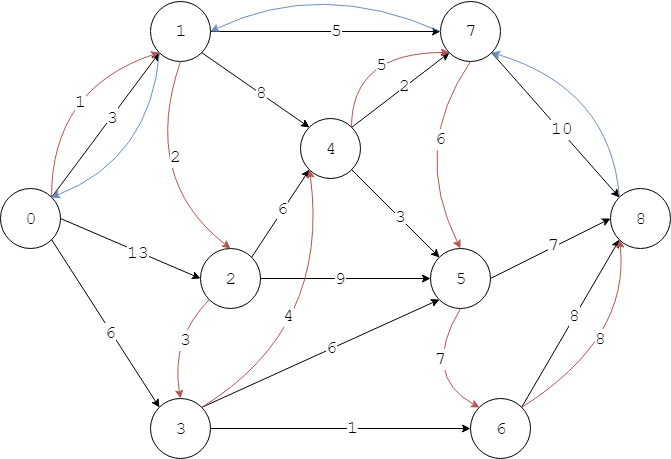
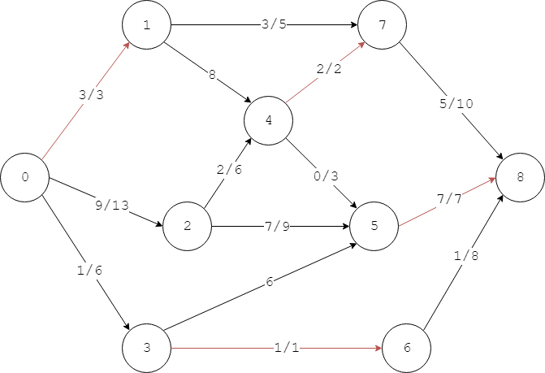

# Edmonds Karp - Edmonds Karp算法（最短路径增广算法）

--------

#### 问题

用Edmond Karp算法求网络流$$ G = <V,E> $$的最大流，$$ G $$是单源点、单汇点的，边的容量为正整数。

#### Ford–Fulkerson方法

Ford-Fulkerson方法是用于求解最大流的方法（并不是算法），它通过寻找增广路径（Argumenting Path）来求最大流，但具体寻找的方法有多种算法实现。

网络流中边$$ e_{u,v} $$的剩余容量（Residual Capacity）是：

$$
c_f (u,v) = c(u,v) - f(u,v)
$$

边的剩余容量定义了剩余网络（Residual Network）$$ G_f = <V, E_f>  $$，表示该网络的可用容量。

网络中的增广路径是剩余网络中的一条路径$$ (u_1, u_2, \dots, u_n) $$，其中$$ u_1 $$是源点$$ Source $$，$$ u_n $$是汇点$$ Sink $$，且其中每条边的剩余容量都满足$$ c_{u_{i}, u_{i+1}} \gt 0 $$（其中$$ 1 \leq i \lt i+1 \leq n $$）。

Ford-Fulkerson方法的主要过程如下：

$$ (1) $$ 初始时将网络$$ G $$看作一个未被使用的原始剩余网络，该网络的最大流的值初始化为$$ flow_{max} = 0 $$；

$$ (2) $$ 尝试从当前剩余网络中找到一条增广路径，该路径经过的所有边的最小的剩余容量$$ c_{min} $$即为这整条流可以使用的容量（就像木桶能够装的水由最短的那块木板决定一样）。使用该路径后最大流的值增大为$$ flow_{max} = flow_{max} + c_{min} $$，并将该路径经过的边的容量都减去$$ c_{min} $$（更新所有经过的边的剩余容量）；

$$ (3) $$ 重复第$$ (2) $$步直到无法找出更多的增广路径，则$$ flow_{max} $$即为该网络的最大流；

#### Edmonds-Karp算法

Edmonds-Karp算法是Ford-Fulkerson方法的一种经典实现。通过BFS算法找出一条增广路径从源点$$ Source $$到达汇点$$ Sink $$。

设$$ G(i,j) $$表示节点$$ v_i $$到$$ v_j $$的边$$ e_{i,j} $$的容量，$$ c(i,j) $$表示边$$ e_{i,j} $$的剩余容量（显然初始时有$$ G(i,j) = C(i,j) $$），逆向指针$$ from(j) = i $$表示BFS搜索中从节点$$ v_i $$搜索到邻节点$$ v_j $$（或者说节点$$ v_j $$是从节点$$ v_i $$来的）。按照以下步骤进行BFS搜索增广路径：

$$ (1) $$ 初始时设置空队列$$ queue $$，设置任意节点$$ v_i $$的$$ from(i) = nil $$（表示BFS搜索未开始），最大流$$ flow_{max} = 0 $$，将源点$$ Source $$加入队列中并染红；

$$ (2) $$ 当$$ queue $$不为空时，从中取出头节点$$ v_i $$，若该节点是汇点$$ v_i = Sink $$则已经找到一条从源点到汇点的增广路径；若该节点不是汇点则遍历其所有邻节点找出所有的未被染红且剩余容量$$ c(i,j) \gt 0 $$的邻节点$$ v_j $$，将其加入队列$$ queue $$中，染红，并设置逆向指针$$ from(j) = i $$。这样重复，若最终搜索到汇点$$ Sink $$则找到一条增广路径，沿着逆向指针可以得到该增广路径上的所有边；若直到队列$$ queue $$为空也没有搜索到汇点$$ Sink $$则说明无法再找到更多的增广路径；

$$ (3) $$ 重复第$$ (2) $$步，每次找到一条增广路径，路径中剩余容量最小的边的剩余容量$$ c_{min} $$即为该增广路径使用的流，更新该路径上边的剩余容量$$ c(i,j) = c(i,j) - c_{min} $$，更新最大流$$ flow_{max} = flow_{max} + c_{min} $$。当无法找出更多增广路径时算法结束，$$ flow_{max} $$即为该网络的最大流；

下图演示了一条增广路径的搜索过程，其中源点为$$ 0 $$汇点为$$ 8 $$：

图1中的红线是BFS搜索剩余网络中节点的顺序，蓝线是从汇点沿着逆向指针回到源点的路径。

图2是这次搜索的逆向指针。可得增广路径为$$ (0, 1, 7, 8) $$，其中边$$ e_{0,1} = 3 $$是剩余容量最小的边，此条增广路径使用的流为$$ 3 $$。

然后对该增广路径上的所有边更新剩余容量：

可以发现，每次找出一条增广路径后，剩余网络中至少有一条边的剩余容量变为$$ 0 $$，上图中边$$ e_{0,1} $$的剩余容量$$ c(0,1) = 0 $$。

重复进行BFS搜索寻找增广路径，直到无法找出更多的增广路径时，算法结束，如下图所示，其中标记为红色的边都是在搜索中剩余容量被使用为0的边：

该算法时间复杂度为$$ O(\mid V \mid \cdot \mid E \mid^2) $$。

--------

#### Introduction To Algorithms

* [VI.Graph Algorithms - 26.Maximum Flow - 26.2.The-Ford-Fulkerson method](https://mcdtu.files.wordpress.com/2017/03/introduction-to-algorithms-3rd-edition-sep-2010.pdf)

--------

#### 源码

[EdmondsKarp.h](https://github.com/linrongbin16/Way-to-Algorithm/blob/master/src/GraphTheory/NetworkFlow/EdmondsKarp.h)

[EdmondsKarp.cpp](https://github.com/linrongbin16/Way-to-Algorithm/blob/master/src/GraphTheory/NetworkFlow/EdmondsKarp.cpp)

#### 测试

[EdmondsKarpTest.cpp](https://github.com/linrongbin16/Way-to-Algorithm/blob/master/src/GraphTheory/NetworkFlow/EdmondsKarpTest.cpp)
