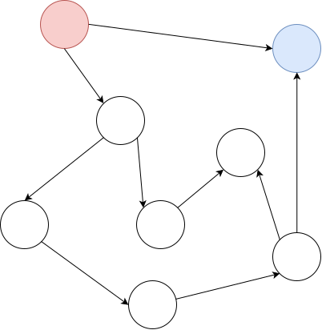

# Chapter-5 Graph Theory
# 第5章 图论

--------

1. Traverse - 遍历
    1. [DepthFirstSearch(DFS) - 深度优先搜索](Traverse/DepthFirstSearch/)
    2. [BreadthFirstSearch(BFS) - 广度优先搜索](Traverse/BreadthFirstSearch/)
    3. [TopologicalSort - 拓扑排序](Traverse/TopologicalSort/)
    4. [EulerCycle - 欧拉回路](Traverse/EulerCycle/)
2. MinimumSpanningTree - 最小生成树
    1. [Kruskal - Kruskal算法](MinimumSpanningTree/Kruskal/)
    2. [Prim - Prim算法](MinimumSpanningTree/Prim/)
    3. [SecondMinimumSpanningTree - 次小生成树](MinimumSpanningTree/SecondMinimumSpanningTree/)
    4. [OptimalRatioSpanningTree - 最优比率生成树](MinimumSpanningTree/OptimalRatioSpanningTree/)
3. ShortestPath - 最短路径
    1. [Relaxation - 松弛操作](ShortestPath/Relaxation/)
    2. [BellmanFord - BellmanFord算法](ShortestPath/BellmanFord/)
    3. [Dijkstra - Dijkstra算法](ShortestPath/Dijkstra/)
    4. [Floyd - Floyd算法](ShortestPath/Floyd/)
    5. [DifferentConstraints - 差分约束](ShortestPath/DifferentConstraints/)
4. Connectivity - 连通
    1. [Kosaraju - Kosaraju算法](Connectivity/Kosaraju/)
    2. [Tarjan - Tarjan算法](Connectivity/Tarjan/)
    3. [Gabow - Gabow算法](Connectivity/Gabow/)
    4. [TwoSatisfiability - 2-SAT问题](Connectivity/TwoSatisfiability/)
    5. [Cut - 割](Connectivity/Cut/)
    6. [DoubleConnectedComponent - 双联通分支](Connectivity/DoubleConnectedComponent/)
    7. [LeastCommonAncestor - 最近公共祖先](Connectivity/LeastCommonAncestor/)
    8. [RangeExtremumQuery - 区域最值查询](Connectivity/RangeExtremumQuery/)
5. FlowNetwork - 网络流
    1. [EdmondsKarp - EdmondsKarp算法](FlowNetwork/EdmondsKarp/)
    2. [PushAndRelabel - 压入与重标记](FlowNetwork/PushAndRelabel/)
    3. [Dinic - Dinic算法](FlowNetwork/Dinic/)
    4. [DistanceLabel - 距离标号算法](FlowNetwork/DistanceLabel/)
    5. [RelabelToFront - 重标记与前移算法](FlowNetwork/RelabelToFront/)
    6. [HighestLabelPreflowPush - 最高标号预留与推进算法](FlowNetwork/HighestLabelPreflowPush/)
    7. [DistanceLabel_AdjacentListVersion - 距离标号算法-邻接表优化版](FlowNetwork/DistanceLabel_AdjacentListVersion/)
    8. [Summary-Maxflow - 最大流算法小结](FlowNetwork/Summary-Maxflow/)
    9. [MinimumCost_Maxflow - 最小费用最大流](FlowNetwork/MinimumCost_Maxflow/)
    10. [MultipleSourceMultipleSink_Maxflow - 多源点、多汇点最大流](FlowNetwork/MultipleSourceMultipleSink_Maxflow/)
    11. [Connectivity - 连通度](FlowNetwork/Connectivity/)
    12. [NoSourceNoSink_VolumeBounded_Flow - 无源点、无汇点、容量有上下界的流网络](FlowNetwork/NoSourceNoSink_VolumeBounded_Flow/)
    13. [VolumeBounded_Maxflow - 容量有上下界的最大流](FlowNetwork/VolumeBounded_Maxflow/)
    14. [VolumeBounded_Minflow - 容量有上下界的最小流](FlowNetwork/VolumeBounded_Minflow/)
6. BinaryMatch - 二分匹配
    1. [Hungarian - 匈牙利算法](BinaryMatch/Hungarian/)
    2. [HopcroftKarp - Hopcroft-Karp算法](BinaryMatch/HopcroftKarp/)
    3. [MatchToMaxflow - 二分匹配转化为最大流](BinaryMatch/MatchToMaxflow/)
    4. [KuhnMunkres - Kuhn-Munkres算法](BinaryMatch/KuhnMunkres/)
    5. [Introduction-Domination_Independent_Covering_Clique - 支配集、独立集、覆盖集、团的介绍](BinaryMatch/Introduction-Domination_Independent_Covering_Clique/)
    6. [WeightedCoveringAndIndependentSet - 最小点权覆盖和最大点权独立集](BinaryMatch/WeightedCoveringAndIndependentSet/)
    7. [MinimumDisjointPathCovering - 最小不相交路径覆盖](BinaryMatch/MinimumDisjointPathCovering/)
    8. [MinimumJointPathCovering - 最小可相交路径覆盖](BinaryMatch/MinimumJointPathCovering/)
    9. [Coloring - 染色问题](BinaryMatch/Coloring/)

--------

#### 图（Graph）

图$$ G = <V,E> $$是由顶点集合$$ V $$和边集合$$ E $$组成的数据结构。一个边连接两个顶点，若两顶点$$ u $$和$$ v $$为一条边的两个端点，则称$$ u $$和$$ v $$相邻。

#### 子图（Subgraph）

一个所有顶点和边都属于图$$ G $$的图，称为$$ G $$的子图。

#### 完全图（Complete Graph）

所有顶点两两相邻的图称为完全图。

#### 无向边

一条无向边$$ e $$的两端点是$$ u $$和$$ v $$，则可以从$$ u $$出发到达$$ v $$，也可以从$$ v $$出发到达$$ u $$。

#### 有向边

一条有向边$$ e $$从$$ u $$指向$$ v $$，则只能从$$ u $$出发到达$$ v $$，不能反向。一条无向边也可以看作两条方向相反，端点相同的有向边的组合。

#### 出度/出弧

节点$$ u $$的出度是从节点$$ u $$出发的边的数量，也称为出度度数，从节点$$ u $$出发的边称为出弧边。对于无向边和无向图来说，节点$$ u $$的所有边都可以看作出弧边，即节点的边数等于出度。

#### 入度/入弧

节点$$ u $$的入度是到达（指向）节点$$ u $$的边的数量，也称为入度度数，到达节点$$ u $$的边称为入弧边。对于无向边和无向图来说，节点$$ u $$的所有边都可以看作入弧边，即节点的边数等于入度。无向图中每个节点的出度和入度相等。

#### 度数

图$$ G $$中的节点$$ u $$所关联的边数，称作该节点的度数。无向图中任意节点$$ v_i $$的度数等于出度度数，也等于入度度数。有向图中任意节点$$ v_i $$的度数等于出度度数与入度度数之和。

上面两个图，图$$ A $$为有向图，节点$$ [0,5] $$的出度分别为$$ [2, 2, 1, 1, 2, 1] $$，入度分别为$$ [1, 1, 2, 2, 0, 2] $$。图$$ B $$为无向图，节点$$ [0,5] $$的出度分别为$$ [3, 4, 3, 3, 2, 3] $$，入度与出度一样。

一般用$$ n \times n $$的矩阵表示一个拥有$$ n $$个节点的图$$ G $$，节点范围为$$ [0,n-1] $$。$$ G[i,j] $$表示从节点$$ i $$到$$ j $$的距离（$$ i,j \in [0,n-1] $$），或节点$$ i $$是否可以直接到达节点$$ j $$，等等信息。注意节点$$ i $$到自己的距离为$$ 0 $$，不能到达自己。上图中$$ A $$和$$ B $$可以表示为矩阵：

$$
A =
\begin{bmatrix}
0 & 1 & 0 & 0 & 0 & 1 \\
0 & 0 & 1 & 1 & 0 & 0 \\
0 & 0 & 0 & 0 & 0 & 1 \\
0 & 0 & 1 & 0 & 0 & 0 \\
1 & 0 & 0 & 1 & 0 & 0 \\
0 & 1 & 0 & 0 & 0 & 0
\end{bmatrix}

\quad

B =
\begin{bmatrix}
0 & 1 & 0 & 0 & 1 & 1 \\
1 & 0 & 1 & 1 & 0 & 1 \\
0 & 1 & 0 & 1 & 0 & 1 \\
0 & 1 & 1 & 0 & 1 & 0 \\
1 & 0 & 0 & 1 & 0 & 0 \\
1 & 1 & 1 & 0 & 0 & 0
\end{bmatrix}
$$

#### 环

若图$$ G $$中存在节点$$ i $$，从它出发可以返回自己，则称这条路径为一个环。不存在环的图称为无环图，存在环的图称为有环图。完全图都是有环图。

#### 拓扑排序

拓扑排序是将图中的节点按照出度、入度排序，起点的入度为$$ 0 $$，终点的出度为$$ 0 $$，其他既有出度也有入度的节点处于拓扑排序的中间位置。只有无环有向图存在拓扑排序，如下图所示：

#### 路径

图$$ G $$的路径是一组边的有序集合，表示随着时间依次经过的边的顺序。

#### 欧拉路径（Eulerian Path）

图$$ G $$中存在这样的路径：经过每条边一次且仅一次（同一个顶点可以经过多次），可以遍历图中的所有边。称这样的路径为欧拉路经。

$$ (1) $$ 判断有向图是否存在欧拉路径：有向图$$ DG $$中存在一个起始顶点$$ v_1 $$满足出度比入度大1（$$ out_{1} = in_{1} + 1 $$），存在一个终止顶点$$ v_2 $$满足入度比出度大1（$$ in_{2} = out_{2} + 1 $$），其余所有顶点的入度等于出度，则该有向图$$ DG $$中存在欧拉路经；

$$ (2) $$ 判断无向图是否存在欧拉路径：无向图$$ UG $$中存在两个顶点$$ v_1 $$和$$ v_2 $$满足度数为奇数，其余节点的度数都是偶数，则该无向图$$ UG $$中存在欧拉路经；

#### 欧拉回路（Eulerian Cycle）

若图$$ G $$存在欧拉路经且欧拉路径是一个回路，则称该路径为欧拉回路。

$$ (1) $$ 判断有向图是否存在欧拉回路：有向图$$ DG $$的任意顶点$$ v_i $$满足$$ in_{i} = out_{i} $$，出度等于入度，则该有向图$$ DG $$中存在欧拉回路；

$$ (2) $$ 判断无向图是否存在欧拉回路：无向图$$ UG $$的任意顶点$$ v_i $$满足度数为偶数，则该无向图$$ DG $$中存在欧拉回路；

#### 欧拉图（Eulerian Diagram）

拥有欧拉回路的图$$ G $$称为欧拉图。

#### 汉密尔顿路径（Hamilton Path）

图$$ G $$中存在这样的路径：经过每个顶点一次且仅一次（同一条边可以经过多次），可以遍历图中的所有顶点。称这样的路径为汉密尔顿路径。求解汉密尔顿路径是一个NP完全问题。

#### 汉密尔顿回路（Hamilton Cycle）

图$$ G $$中存在汉密尔顿路径且哈密尔顿路径是一个回路，则称该路径为汉密尔顿回路。

#### 汉密尔顿图（Hamilton Diagram）

拥有汉密尔顿回路的图$$ G $$称为汉密尔顿图。完全图必然是汉密尔顿图。

#### 最小生成树（Minimum Spanning Tree）

图$$ G $$中存在这样的路径：非环路径，连接图$$ G $$的所有顶点，则称该路径为图$$ G $$的生成树。图$$ G $$中的每个边都有一个权值，边的权值之和最小的生成树，为该图的最小生成树。

#### 平凡图（Trivial Graph）

只有一个节点，没有边的图。

#### 非平凡图（Nontrivial Graph）

有至少两个节点，一条边的图。

#### 连通（Connectivity）

若图$$ G $$存在路径可以从顶点$$ v_i $$到达顶点$$ v_j $$，且从顶点$$ v_j $$也可以到达顶点$$ v_i $$，称$$ v_i $$和$$ v_j $$是连通的。

无向图中，若$$ v_i $$可以到达$$ v_j $$，则显然$$ v_j $$也可以到达$$ v_i $$。有向图中则不一定。

#### 连通图（Connected Graph）

若图$$ G $$中任意两个顶点都是连通的，称$$ G $$是连通图。

#### 极大连通子图（Strong Components）

若图$$ G $$的子图$$ S $$是连通图，且加入任意其他节点都会使子图$$ S $$不再连通，则称$$ S $$为极大连通子图。连通图的极大连通子图即为它自己，非连通图中存在多个极大连通子图。

#### 连通分量/连通分支/强连通分量/强连通分支（Connected Component/Strongly Connected Component）

连通分量/连通分支是无向图$$ G $$的一个极大连通子图。

强连通分量/强连通分支是有向图$$ G $$的一个极大连通子图。求强连通分量的算法有双向遍历后取交集、Tarjan算法、Kosaraju算法、Gabow算法。

#### 逆图（Reverse Graph）

图$$ G = <V, E> $$的逆图，是将其所有边都进行反向，得到$$ G' = <V', E'> $$。点集$$ V' = V $$相同，而边集$$ E' $$中的任意边$$ e' = (v, u) $$都在$$ E $$中存在对应的边$$ e = (u, v) $$。逆图$$ G' $$也称为图$$ G $$的转置。无向图的逆图永远都是它自己。

#### 割（Cut）

割$$ C = <S, T> $$将图$$ G = <V, E> $$划分为两个子图$$ S $$和$$ T $$，两个子图的顶点集合没有交集$$ S \bigcap T = \emptyset $$，对图中的任意边$$ e = (u, v) $$，顶点$$ u $$属于子图$$ S $$，顶点$$ v $$属于子图$$ T $$。

图$$ G $$的所有的割组成割集$$ CS = { (u, v) \in E | u \in S, v \in T } $$，其中$$ S, T $$是互不相交的子图。

#### 点割集

图$$ G = <V, E> $$的点集$$ V $$中存在一个非空真子集$$ V_1 $$，满足$$ G $$中删去$$ V_1 $$后不再连通。但对于$$ V_1 $$的任意真子集$$ V_2 $$，$$ G $$中删去$$ V_2 $$后都仍然连通，称这样的点集$$ V_1 $$是$$ G $$的一个点割集。非平凡的无向连通图存在点割集的充要条件是该图中至少存在两个不相邻的相异节点。

#### 边割集

图$$ G = <V, E> $$的边集$$ E $$中有这样的非空真子集$$ E_1 $$，$$ G $$中删去$$ E_1 $$后不再连通。但对于$$E_1$$的任意真子集$$E_2$$，$$G$$中删去$$E_2$$后都仍然连通，称这样的边集$$E_1$$是$$G$$的一个边割集。任何非平凡的无向连通图一定具有边割集。

#### 点连通度

非平凡的无向连通图$$G$$的所有点割集$$V_{cut}$$中的节点数量最少的那个点割集$$V_1$$，其节点数量$$k$$即为图$$G$$的点连通度。即图$$G$$删除任意$$k-1$$个节点后都仍然能够连通，但存在一个方案（点割集）使删除$$k$$个节点后不连通。特别的，当$$k = 2$$时，即图$$G$$任意删除$$1$$个节点都仍然能够连通，但存在一个方案，删除$$2$$个节点后不再连通，称点连通度$$k = 2$$的连通分支(图)为点双连通分支。

#### 边连通度

非平凡的无向连通图$$G$$的所有边割集$$E_{cut}$$中的边数量最少的那个边割集$$E_1$$，其边数量$$k$$即为图$$G$$的边连通度，即图$$G$$删去任意$$k-1$$条边后都仍然能够连通，但存在一个方案(边割集)使删除k条边后不再连通。特别的，当k = 2时，即该图任意删除1条边都仍然连通，但存在一个方案使删除2条边后不再连通，称边连通度k = 2的连通分支(图)为边双连通分支。

#### 割点

无向图$$G$$中存在某个点$$v_1$$，删去该点后图的连通分支数量加1，即该点将原图分成两个连通分支，则称点$$v_1$$为无向图$$G$$的割点。假设删去一个割点后得到两个新的连通分支，则割点可以看作同时属于两个新连通分支，而非割点总是只属于一个连通分支。

#### 割边（桥）

无向图$$G$$中存在某条边$$e_1$$，删去该边后图的连通分支数量加1，即该边将原图分成两个连通分支。假设删去一条割边后得到两个新的连通分支，则割边的两端点可以看作分别属于两个新连通分支，而非割边的两端点只属于同一个连通分支。

--------

#### 图论术语

* https://zh.wikipedia.org/wiki/%E5%9B%BE%E8%AE%BA%E6%9C%AF%E8%AF%AD
