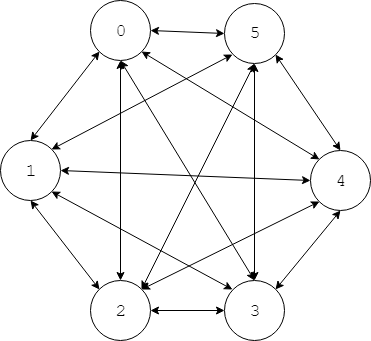
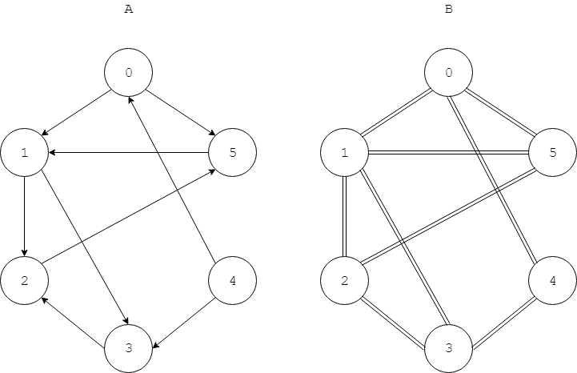
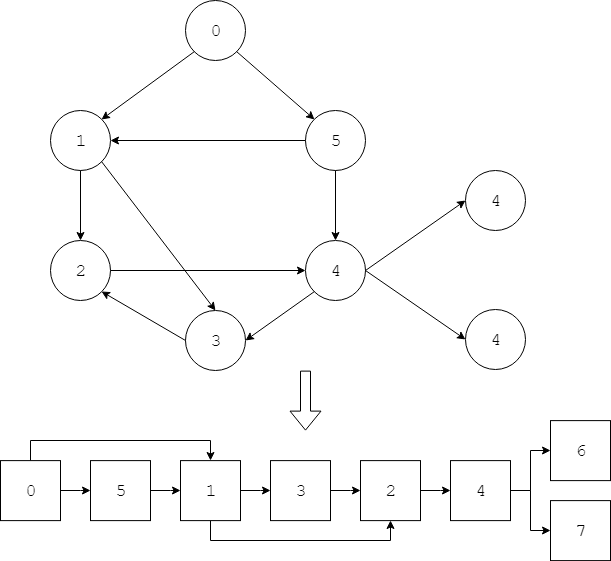

# Section-1 Traverse
# 第1节 遍历

--------

1. [DepthFirstSearch(DFS) - 深度优先搜索](DepthFirstSearch/)
2. [BreadthFirstSearch(BFS) - 广度优先搜索](BreadthFirstSearch/)
3. [TopologicalSort - 拓扑排序](TopologicalSort/)
4. [EulerCycle - 欧拉回路](EulerCycle/)

--------

#### 图（Graph）

图$$ G = <V,E> $$是由顶点集合$$ V $$和边集合$$ E $$组成的数据结构。一个边连接两个顶点，若两顶点$$ u $$和$$ v $$为一条边的两个端点，则称$$ u $$和$$ v $$相邻。

图$$ G $$的子图的所有顶点和边都属于图$$ G $$。

完全图（Complete Graph）的所有顶点两两相邻。如下图所示：

#### 有向图（Directed Graph）/无向图（Undirected Graph）

无向边$$ e $$的两端点是$$ u $$和$$ v $$，表示既可以从$$ u $$到达$$ v $$，也可以从$$ v $$到达$$ u $$。有向边$$ e $$从$$ u $$指向$$ v $$，表示只能从$$ u $$到达$$ v $$，而不能反向。一条无向边也可以看作两条方向相反，端点相同的有向边的组合。

所有边都是无向边的图为无向图（Undirected Graph），所有边都是有向边的图为有向图（Directed Graph）。

#### 度数（Degree）/出度（Out Degree）/入度（In Degree）

节点$$ u $$的出度（Out Degree）是从节点$$ u $$出发的边的数量，也称为出度度数，从节点$$ u $$出发的边称为出弧边。无向图的顶点$$ u $$的所有边都可以看作出弧边，即节点的边数等于出度。

节点$$ u $$的入度（In Degree）是到达（指向）节点$$ u $$的边的数量，也称为入度度数，到达节点$$ u $$的边称为入弧边。无向图的顶点$$ u $$的所有边都可以看作入弧边，即节点的边数等于入度。无向图中每个节点的出度和入度相等。

节点$$ u $$所关联的边数，称作该节点的度数（Degree）。无向图中节点$$ v_i $$的度数等于边的数量，等于出度度数，等于入度度数。有向图中任意节点$$ v_i $$的度数等于出度度数与入度度数之和。如下图所示：

上面两个图，图$$ A $$为有向图，节点$$ [0,5] $$的出度分别为$$ [2, 2, 1, 1, 2, 1] $$，入度分别为$$ [1, 1, 2, 2, 0, 2] $$。图$$ B $$为无向图，节点$$ [0,5] $$的出度分别为$$ [3, 4, 3, 3, 2, 3] $$，入度与出度一样。

一般用$$ n \times n $$的矩阵表示一个拥有$$ n $$个节点的图$$ G $$，节点范围为$$ [0,n-1] $$。$$ G[i,j] $$表示从节点$$ i $$到$$ j $$的距离（$$ i,j \in [0,n-1] $$），或节点$$ i $$是否可以直接到达节点$$ j $$，等等信息。注意节点$$ i $$到自己的距离为$$ 0 $$，不能到达自己。上图中$$ A $$和$$ B $$可以表示为矩阵：

$$
A =
\begin{bmatrix}
0 & 1 & 0 & 0 & 0 & 1 \\
0 & 0 & 1 & 1 & 0 & 0 \\
0 & 0 & 0 & 0 & 0 & 1 \\
0 & 0 & 1 & 0 & 0 & 0 \\
1 & 0 & 0 & 1 & 0 & 0 \\
0 & 1 & 0 & 0 & 0 & 0
\end{bmatrix}

\quad

B =
\begin{bmatrix}
0 & 1 & 0 & 0 & 1 & 1 \\
1 & 0 & 1 & 1 & 0 & 1 \\
0 & 1 & 0 & 1 & 0 & 1 \\
0 & 1 & 1 & 0 & 1 & 0 \\
1 & 0 & 0 & 1 & 0 & 0 \\
1 & 1 & 1 & 0 & 0 & 0
\end{bmatrix}
$$

#### 环（Cycle）

若图$$ G $$中对于顶点$$ v_i $$，存在一条路径从它出发可以到达自己，则称该路径为一个环。不存在环的图称为无环图，存在环的图称为有环图。完全图都是有环图。

#### 拓扑排序（Topological Sort）

拓扑排序（Topological Sort）是有向无环图中所有顶点按照依赖进行的排序。

设完成任务$$ j $$需要先完成任务$$ i $$，则任务$$ j $$依赖任务$$ i $$。用有向图表示这一组任务的完成过程这样存在依赖关系的$$ n $$个任务，即存在边$$ e_{i,j} $$从顶点$$ v_i $$指向$$ v_j $$，最终得到一个有向无环图。如下图所示：

#### 路径（Path）/回路（Cycle）

图$$ G $$的路径（Path）是一组边的有序集合，表示随着时间依次经过的边的顺序。回路（Cycle）是起点和终点相同的路径。

#### 欧拉路径（Eulerian Path）/欧拉回路（Eulerian Cycle）

欧拉路径（Eulerian Path）经过图$$ G $$中每条边一次且仅一次（同一个顶点可以经过多次），遍历所有边。

判断欧拉路径：

$$ (1) $$ 判断有向图是否存在欧拉路径：有向图$$ DG $$中存在一个起始顶点$$ v_0 $$满足出度比入度大1（$$ out_{1} = in_{1} + 1 $$），存在一个终止顶点$$ v_1 $$满足入度比出度大1（$$ in_{2} = out_{2} + 1 $$），其余所有顶点的入度等于出度，则该有向图$$ DG $$中存在欧拉路经；

$$ (2) $$ 判断无向图是否存在欧拉路径：无向图$$ UG $$中存在两个顶点$$ v_0 $$和$$ v_1 $$满足度数为奇数，其余节点的度数都是偶数，则该无向图$$ UG $$中存在欧拉路经；

欧拉回路（Eulerian Cycle）是既是欧拉路径又是回路的路径。

判断欧拉回路：

$$ (1) $$ 判断有向图是否存在欧拉回路：有向图$$ DG $$的任意顶点$$ v_i $$满足$$ in_{i} = out_{i} $$，出度等于入度，则该有向图$$ DG $$中存在欧拉回路；

$$ (2) $$ 判断无向图是否存在欧拉回路：无向图$$ UG $$的任意顶点$$ v_i $$满足度数为偶数，则该无向图$$ DG $$中存在欧拉回路；

拥有欧拉回路的图$$ G $$称为欧拉图（Eulerian Graph）。

#### 汉密尔顿路径（Hamilton Path）/哈密尔顿回路（Hamilton Cycle）

汉密尔顿路径（Hamilton Path）经过图$$ G $$中每个顶点一次且仅一次（同一条边可以经过多次），遍历所有顶点。求解汉密尔顿路径是一个NP完全问题。

哈密尔顿回路（Hamilton Cycle）是既是哈密尔顿路径又是回路的路径。

拥有汉密尔顿回路的图$$ G $$称为汉密尔顿图。完全图必然是汉密尔顿图。

--------

#### Introduction To Algorithms

* [VI.Graph Algorithms](https://www.google.com/search?q=Introduction+to+Algorithms+3rd+Edition+pdf)

#### 图论术语

* https://en.wikipedia.org/wiki/Glossary_of_graph_theory_terms
