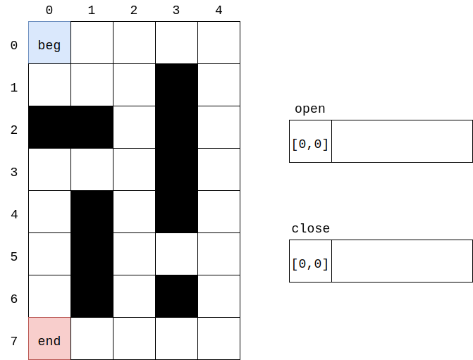

# A Star Search - A\*搜索

--------

#### 问题

对于\\( 3 \times 3 \\)的矩阵

$$
\begin{bmatrix}
2 & 8 & 1 \\
3 & 7 & x \\
6 & 4 & 5
\end{bmatrix}
$$

$$ x $$点可以与上下左右的相邻点交换位置，除此之外不能随意改变位置，将该矩阵变成

$$
\begin{bmatrix}
1 & 2 & 3 \\
4 & 5 & 6 \\
7 & 8 & x
\end{bmatrix}
$$

求最少变换次数以及变化经过，若将矩阵的初始状态看作起点$$ beg $$，最终状态看作终点$$ end $$，即搜索$$ beg $$到$$ end $$的最短路径。

本问题的原型是“八数码问题”。

#### 解法

与之前问题不同，本问题将每种矩阵状态看作一个节点，是一种时间上的状态搜索。本文用A\*搜索来解决该问题，A\*算法是一种启发式搜索，与DFS和BFS这种无差别搜索不同，A\*算法设置一个评价函数$$ f(x) $$来计算节点$$ x $$的搜索代价（到目标的距离），优先搜索那些离目标最近的点，从而提高搜索效率。

A\*算法的评价函数$$ f(x) = g(x) + h(x) $$，其中$$ x $$是节点，$$ f(x) $$表示$$ x $$点到$$ end $$的评价距离，$$ g(x) $$表示从$$ beg $$节点到$$ x $$节点的实际最短距离，$$ h(x) $$表示从$$ x $$点到$$ end $$节点的估算距离。在A\*算法的等待队列中，总是优先选取$$ f(x) $$最小的点进行搜索。

在本问题中矩阵节点$$ x $$的估算距离为$$ x $$与$$ end $$在对应位置$$ [i,j] $$（其中$$ i,j \in [1,3] $$）上不同数字的数量之和：

$$
\begin{equation}
h(x) = \sum_{i=1}^3 \sum_{j=1}^3 k_{i,j}
\end{equation} \quad \quad
k_{i,j} =
\begin{cases}
1 & { x_{i,j} = end_{i,j} }     \\
0 & { x_{i,j} \neq end_{i,j} }
\end{cases}
$$

对于下面的矩阵，$$ h(a) = 6 $$，$$ h(b) = 7 $$：

$$
a
\begin{bmatrix}
1 & 2 & 3 \\
4 & 5 & 6 \\
7 & 8 & x
\end{bmatrix}
\quad

b
\begin{bmatrix}
1 & 2 & 3 \\
4 & x & 5 \\
7 & 8 & 6
\end{bmatrix}
\quad

c
\begin{bmatrix}
1 & x & 3 \\
5 & 2 & 6 \\
4 & 7 & 8
\end{bmatrix}
$$

与之前的问题不同，本问题中的节点是一种矩阵状态。之前的解法中我们用染色的方式来标记节点是否被访问过，编码实现时可以用数组下标来标记节点$$ i $$的颜色。而矩阵状态是无法作为数组下标的，不过我们可以用哈希表来记录矩阵状态$$ x $$是否被访问过，以及从$$ beg $$节点到达$$ x $$的节点距离。矩阵可以通过下面这两种方式分别映射为字符串或数字（string和int都可以作为哈希表键值）：

$$
\begin{bmatrix}
1 & 2 & 3 \\
4 & x & 5 \\
7 & 8 & 6
\end{bmatrix}

\Rightarrow
string("1234x5786")
\quad
\begin{bmatrix}
1 & 2 & 3 \\
4 & x & 5 \\
7 & 8 & 6
\end{bmatrix}

\Rightarrow
int(123495786)
$$

设置$$ open $$表、$$ close $$表和$$ g $$分数表。$$ g $$分数表是一个哈希表$$ x \Rightarrow g(x) $$，用来存储每个节点的实际距离$$ g(x) $$。open表是一个优先队列，与之前搜索算法中的队列功能相同，用于管理等待访问的节点，但是我们需要从open表中总是优先取出可能离$$ end $$最近的节点，因此其优先级为评价距离$$ f(x) $$。close表是一个节点$$ x $$的集合，用于查询所有已经访问过的节点。

初始时我们将$$ beg $$节点插入$$ open $$表和$$ close $$表中，令$$ g(beg) = 0 $$。

每一次搜索中，从$$ open $$表中取出评价距离$$ f $$最小的节点$$ node $$，若$$ node = end $$则算法结束；否则将$$ node $$插入$$ close $$表中（也可称为染色，染色的、属于$$ close $$表中的节点都是不能再被访问的），该矩阵中的$$ 'x' $$与上下左右四个数字交换位置，得到新的四个节点$$ e_1 $$、$$ e_2 $$、$$ e_3 $$、$$ e_4 $$，若他们不在$$ close $$表中，将其插入$$ open $$表和$$ close $$表中。

在维护$$ open $$中节点的优先级时需要使用$$ g(x) $$，因为$$ f(x) = g(x) + h(x) $$。

当搜索到$$ open $$表中没有节点可以访问时，则说明$$ beg $$节点永远无法到达$$ end $$节点，两个矩阵状态无法转换。更复杂一些的情况，在$$ beg $$可以到达end的基础上，需要求出从$$ beg $$到$$ end $$的路径，这时我们可以把$$ close $$表改为哈希表$$ x \Rightarrow from(x) $$，用来存储节节点$$ x $$及其父节点$$ from $$，最后从$$ end $$节点反向，通过查找$$ close $$表就可以找到一条反向的路径。

本问题中A\*搜索的时间复杂度为$$ O(9^9) $$。

--------

#### 八数码问题

* http://www.d.umn.edu/~jrichar4/8puz.html
* https://www.cs.princeton.edu/courses/archive/fall12/cos226/assignments/8puzzle.html

--------

#### 源码

[import, lang:"c_cpp"](../../../src/Search/AStarSearch.h)

#### 测试

[import, lang:"c_cpp"](../../../src/Search/AStarSearch.cpp)
