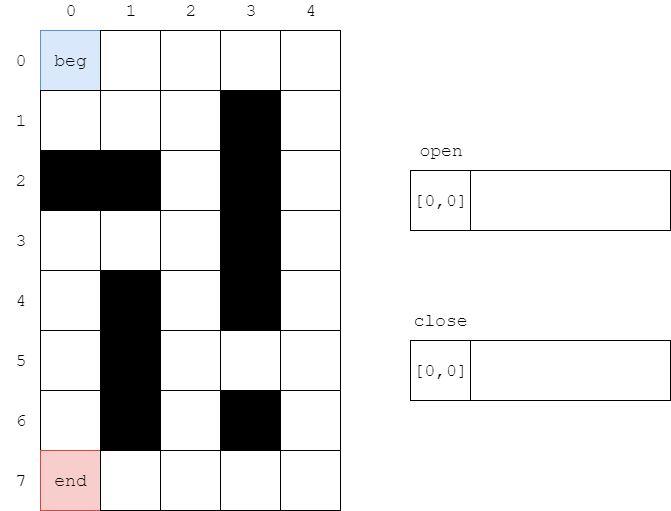

# A Star Search - A\*搜索

--------

#### 问题

在$$ m \times n $$的二维方格图$$ s $$中从$$ beg $$点移动到$$ end $$点。$$ s $$中存在一些黑色的方块阻隔移动。

#### 解法

A\*算法是一种启发式搜索（DFS和BFS属于无差别搜索），通过函数$$ f(x) $$来评价节点$$ x $$的搜索代价（到目标的距离）。当存在多个待搜索节点时，总是优先搜索那些离目标更最近的点来提高搜索效率。

对于节点$$ x $$，函数$$ f(x) = g(x) + h(x) $$，其中$$ f(x) $$表示$$ x $$点到$$ end $$的估算/评价距离，$$ g(x) $$表示从$$ beg $$节点到$$ x $$节点需要移动的最短距离，$$ h(x) $$表示从$$ x $$点到$$ end $$节点的估算距离。

设置$$ open $$表和$$ close $$表，其中$$ open $$表类似BFS中的队列，存放待搜索的节点$$ o $$；$$ close $$表存放所有已搜索过的节点$$ c $$，并存储从$$ beg $$到达$$ c $$的最短距离$$ g(c) $$。

初始时将$$ beg $$推入$$ open $$和$$ close $$中，且$$ close[beg] = 0 $$，表示$$ beg $$到达自己的最短距离为$$ 1 $$。注意本算法中不会使用染色来标记某个节点是否已经被访问，而是用$$ close $$表来记录。

每次从$$ open $$取出节点$$ x $$，该节点满足$$ f(x) $$在$$ open $$中是最小的（若存在多个相同的最小$$ f(x) $$则随意选取其中一个即可），若$$ x = end $$则搜索结束；否则考虑将$$ x $$四周的节点$$ y $$加入$$ open $$表中，且显然因为多走了一步有$$ g(y) = g(x) + 1 = close[x] + 1 $$。注意，若$$ close $$中已经存在$$ y $$节点，说明在此之前$$ y $$已经被搜索过，这时比较旧的$$ g(y)_{old} $$与当前新的$$ g(y)_{new} $$，显然为了搜索最短路径，若$$ g(y)_{old} > g(y)_{new} $$则用新路径替换旧路径，否则忽略节点$$ y $$不将其加入$$ open $$表。

当$$ open = \emptyset $$为空时，说明$$ beg $$永远无法到达$$ end $$。

本问题中A\*搜索的时间复杂度为$$ O(n \times m) $$。

--------

#### 八数码问题

* http://www.d.umn.edu/~jrichar4/8puz.html
* https://www.cs.princeton.edu/courses/archive/fall12/cos226/assignments/8puzzle.html

--------

#### 源码

[AStarSearch.h](https://github.com/linrongbin16/Way-to-Algorithm/blob/master/src/Search/AStarSearch.h)

[AStarSearch.cpp](https://github.com/linrongbin16/Way-to-Algorithm/blob/master/src/Search/AStarSearch.cpp)

[import, lang:"c_cpp"](../../../src/Search/AStarSearch.h)

[import, lang:"c_cpp"](../../../src/Search/AStarSearch.cpp)

#### 测试

[AStarSearchTest.cpp](https://github.com/linrongbin16/Way-to-Algorithm/blob/master/src/Search/AStarSearchTest.cpp)

[import, lang:"c_cpp"](../../../src/Search/AStarSearchTest.cpp)
