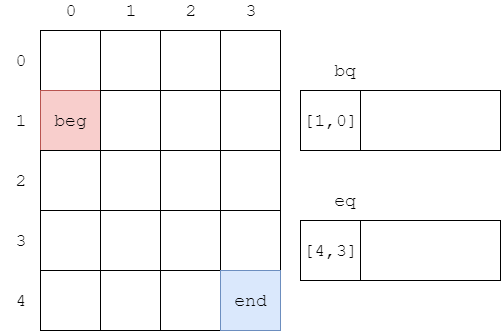
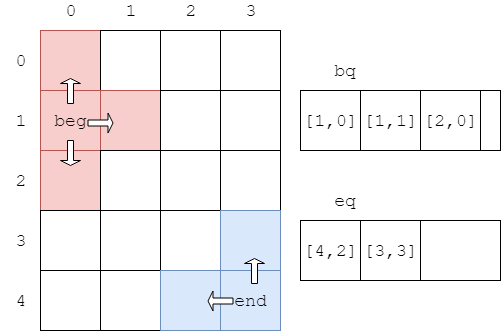
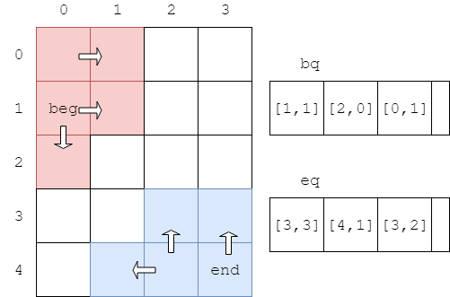
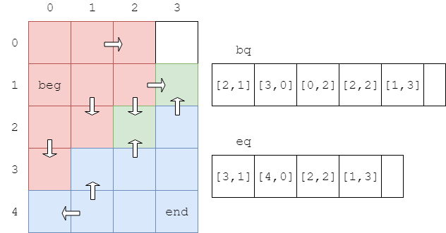
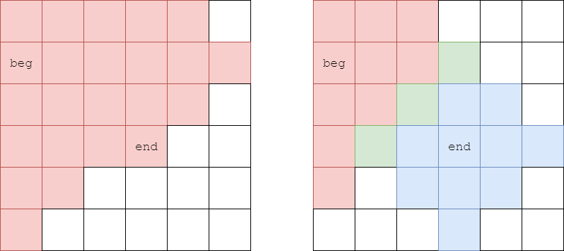

# Bidirectional Breadth Search - 双向广度搜索

--------

#### 问题

在$$ m \times n $$的二维方格图$$ s $$中用双向广度搜索从$$ beg $$点移动到$$ end $$点。

#### 解法

双向广度优先搜索是在广度优先搜索基础上的一个变种，搜索速度更快。该算法从$$ beg $$和$$ end $$两个点开始，同时进行广度优先搜索，两边的点在某一处相遇，即可得到一条从$$ beg $$到$$ end $$的路径。

初始时将$$ beg $$和$$ end $$分别加入两个队列$$ bq $$和$$ eq $$中。每次分别从$$ bq $$和$$ eq $$队列中取出节点$$ x $$和$$ y $$进行访问，在节点加入$$ bq $$之前将其染成红色，加入$$ eq $$之前其染成绿色。若$$ x $$取出后发现已被染成绿色，说明$$ x $$被$$ eq $$访问过，或$$ y $$取出后发现其已被染成红色，说明$$ y $$被$$ bq $$访问过。说明两个队列在此处相遇，算法结束。

在下面这个$$ m = 4 $$，$$ n = 5 $$的二维方格$$ s $$中，从$$ beg = [0,1] $$移动到$$ end = [3,4] $$的过程如下：

$$ (1) $$初始时，将$$ beg = [0,1] $$染红并加入$$ bq $$中，将$$ end = [3,4] $$染绿并加入$$ eq $$；

$$ (2) $$从$$ bq $$中取出头节点$$ [0,1] $$，将其四周未被染色的邻节点$$ [0,0] $$、$$ [1,1] $$、$$ [0,2] $$染红并加入$$ bq $$中。从$$ eq $$中取出头节点$$ [3,4] $$，将其四周未被染色的邻节点$$ [2,4] $$、$$ [3,3] $$染红并加入$$ eq $$中；

$$ (3) $$从$$ bq $$中取出头节点$$ [0,0] $$，将其四周未被染色的邻节点$$ [1,0] $$染红并加入$$ bq $$中。从$$ eq $$中取出头节点$$ [2,4] $$，将其四周未被染色的邻节点$$ [1,4] $$、$$ [2,3] $$染红并加入$$ eq $$中；

$$ (4) $$从$$ bq $$中取出头节点$$ [1,1] $$，将其四周未被染色的邻节点$$ [2,1] $$、$$ [1,2] $$染红并加入$$ bq $$中。从$$ eq $$中取出头节点$$ [3,3] $$，将其四周未被染色的邻节点$$ [3,2] $$染红并加入$$ eq $$中；

$$ (5) $$从$$ bq $$中取出头节点$$ [0,2] $$，将其四周未被染色的邻节点$$ [0,3] $$染红并加入$$ bq $$中。从$$ eq $$中取出头节点$$ [1,4] $$，将其四周未被染色的邻节点$$ [1,3] $$、$$ [0,4] $$染红并加入$$ eq $$中；

$$ (6) $$从$$ bq $$中取出头节点$$ [1,0] $$，将其四周未被染色的邻节点$$ [2,0] $$染红并加入$$ bq $$中。从$$ eq $$中取出头节点$$ [2,3] $$，将其四周未被染色的邻节点$$ [2,2] $$染红并加入$$ eq $$中；

$$ (7) $$从$$ bq $$中取出头节点$$ [2,1] $$，将其邻节点$$ [2,2] $$已经被染绿，说明该节点已经被加入$$ eq $$中，或已经被$$ eq $$访问过了。因此$$ [2,2] $$为$$ bq $$和$$ eq $$相遇的位置，算法结束；

对于二维方格$$ s $$，广度优先搜索从$$ beg $$点遍历到$$ end $$点的过程一般是从$$ beg $$向四周发散开，一直到达$$ end $$点：

而双向广度优先搜索则是从$$ beg $$和$$ end $$两个点分别发散开，在中间相遇：

双向广度搜索的时间复杂度与广度优先搜索一样，也是$$ O(m \times n) $$。

--------

#### 源码

[import, lang:"c_cpp"](../../../src/Search/BidirectionalBreadthSearch.h)

#### 测试

[import, lang:"c_cpp"](../../../src/Search/BidirectionalBreadthSearch.cpp)
