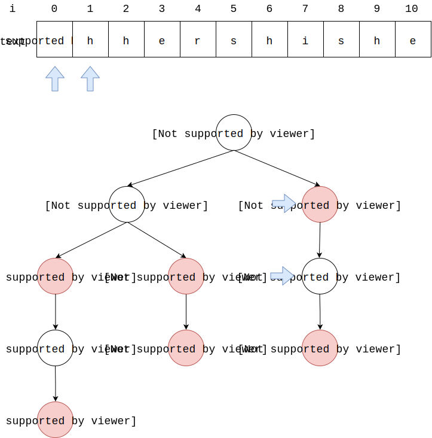
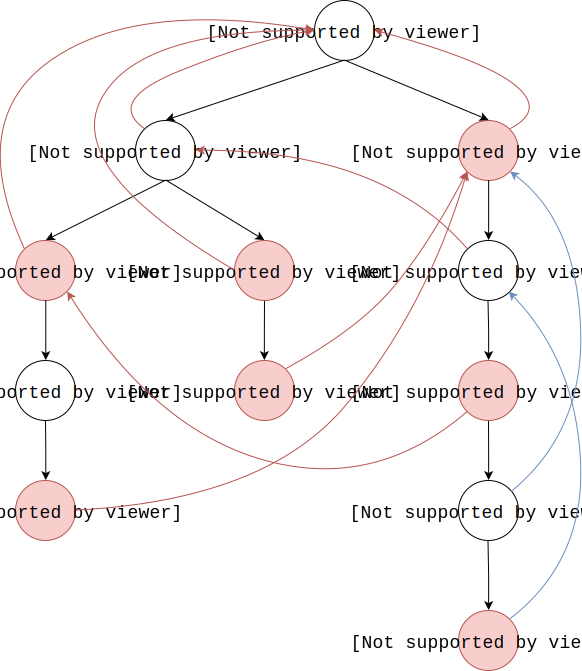
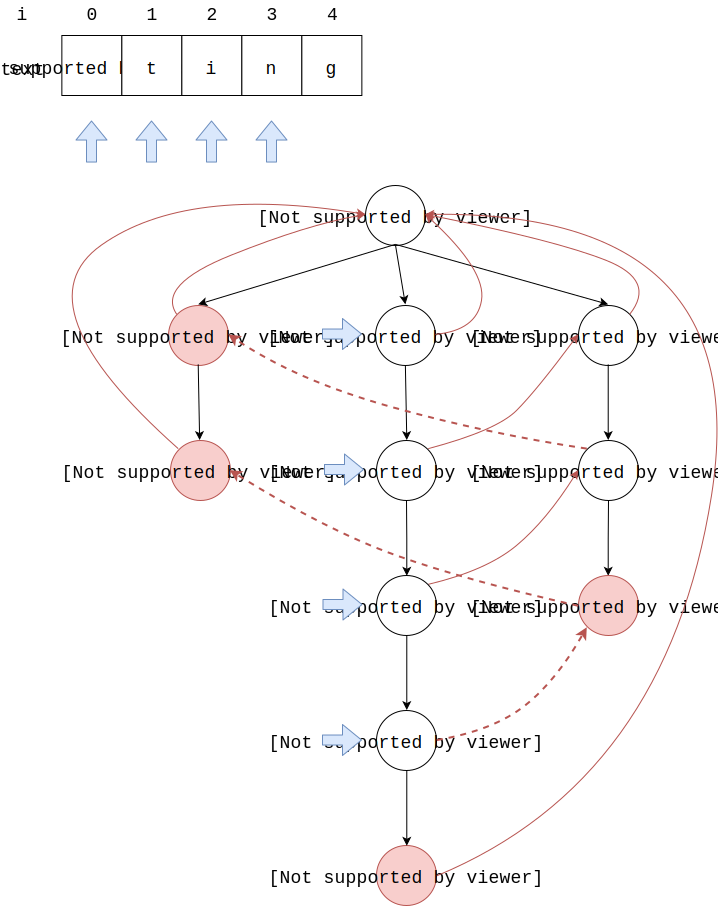
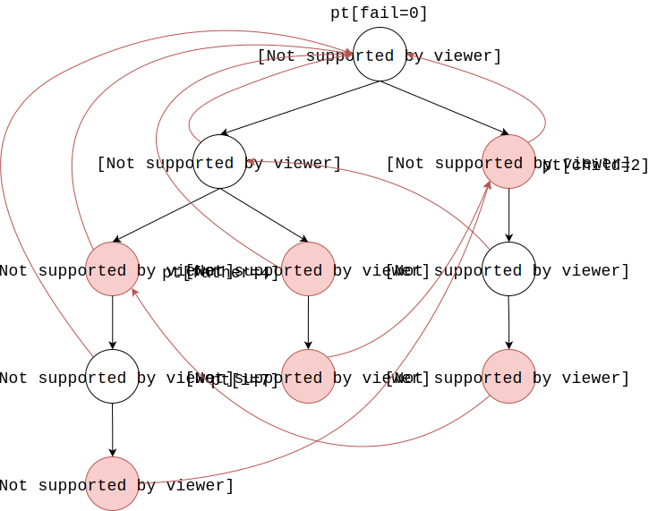

# Aho Corasick Automata - AC自动机

--------

#### 问题

在文本$$ text $$中查找$$ k $$个模式$$ pattern $$出现的所有位置（其中$$ text $$长度为$$ n $$，$$ pattern_{i} $$的长度为$$ m_{i} $$，其中最长的模式长度为$$ m_{max} $$且$$ n \gt m_{max} $$，所有模式长度之和为$$ m_{sum} = \sum_{i=1}^{k} m_{i} $$，且所有模式中的$$ pattern $$没有重复的字符串）。

#### 简单字符串匹配算法

将简单字符串匹配SimpleMatch应用在本问题上，搜索所有模式需要重复$$ k $$次，每次的时间复杂度为$$ O(n \cdot m_{i}) $$。直接应用SimpleMatch算法的时间复杂度为$$ O_{1} = O(n \cdot m_{sum}) $$。

#### 前缀树

我们能否在一次匹配$$ text $$的过程中就同时找出所有模式呢？即并行算法（算法上的并行，非多线程多进程的并行）。

首先用所有$$ pattern $$构造一个前缀树$$ pt $$，如图所示：

$$ (1) $$ 从$$ text $$的首个字符$$ text[i = 0] $$开始，将其与前缀树中的节点依次向下匹配，可知$$ text[0 \dots 1] = pt[2 \dots 5]$$，但$$ text[2] \ne pt[8] $$因此匹配失败；

$$ (2) $$ 匹配位置向右移动一位，从$$ text[i = 1] $$开始，可知$$ text[1] = pt[1]$$但$$ text[2] \ne pt[3], text[2] \ne pt[4] $$；

$$ (3) $$ 匹配位置向右移动一位，从$$ text[i = 2] $$开始匹配，可知$$ text[2 \dots 3] = pt[1 \dots 3], text[2 \dots 5] = pt[1 \dots 9] $$匹配成功；

$$

\cdots

$$

构建前缀树的时间复杂度为$$ O(m_{sum}) $$，之后对于文本上每个字符，都匹配一次前缀树即可，该算法的时间复杂度为$$ O_{2} = O(m_{sum}) + O(n \cdot max(m_{i})) $$。当$$ n $$远大于$$ max(m_{i}) $$时显然构造第二种算法更优。

#### 失败指针

下图中，当匹配到$$ text[i = 5] $$时有$$ text[5 \dots 6] = pt[2 \dots 5] $$，但$$ text[7] \ne pt[8] $$匹配失败。我们不希望从$$ text[i = 6] $$处从前缀树的根节点重新开始匹配，显然$$ text[i = 6] $$在前缀树中已经存在。因为$$ pt[1 \dots 1] $$是$$ pt[2 \dots 5] $$的后缀字符串，这时将前缀树的匹配位置调整到$$ pt[1] $$，那么$$ pt[1] $$和$$ text[i = 6] $$可以继续匹配，尝试找到一个成功的匹配。图中红色的连线称为失败链接/失败指针$$ failure link $$；

设字符串$$ \alpha $$的末尾字符为$$ pt[i] $$，尝试在前缀树中寻找$$ \alpha $$的最长后缀字符串$$ \beta $$（设$$ pt[j] $$是$$ \beta $$的末尾字符）。若找到这样一个合适的$$ \beta $$，建立从$$ pt[i] $$到$$ pt[j] $$的指针，否则建立从$$ pt[i] $$到$$ pt[root] $$的指针。显然前缀树中每个节点只有一个失败指针。失败指针的出发节点是前缀树中最后一个成功匹配的字符，其实质是后缀字符串，也称后缀链接/后缀指针$$ suffix link $$。

失败指针的核心思路在于匹配文本失败时，希望避免从前缀树的根部重新开始匹配。失败指针要么指向一个与当前位置上字符串相同的最长的后缀字符串（这样的指针就是后缀指针），要么指向前缀树的根节点。比如下图中$$ pt[2 \dots 5] = "sh" $$的最长后缀字符串是$$ pt[1 \dots 1] = "h" $$，$$ pt[2 \dots 8] = "she" $$的最长后缀字符串是$$ pt[1 \dots 3] = "he" $$。$$ pt[1 \dots 4] = "hi" $$找不到最长后缀字符串（也可以认为最长后缀字符串为空），因此有失败指针$$ pt[4] \rightarrow pt[root] $$。

前缀树中的失败指针联系的两个节点可能在同一个字符串上，比如下图中有失败指针$$ pt[11] \rightarrow pt[5] $$，$$ pt[10] \rightarrow pt[2] $$，这两个失败指针在前缀树中构成了环形图。

#### 输出指针

下图中，当匹配到$$ text[10] = pt[8] $$时（即使在该位置没有$$ text[8 \dots 10] = pt[2 \dots 8] $$匹配成功也同样适用），我们发现不管前缀树当前位置$$ pt[8] $$匹配成功与否，一定存在成功的匹配$$ pt[1 \dots 3] $$。利用这一特性避免了从$$ text[i = 9] $$和前缀树的根节点重新开始匹配。显然这也是失败指针，但并非在匹配失败时才跳转，这类跳转称为输出指针/输出链接$$ output link $$，用红色虚线表示。

再给一个特别情况，当匹配到$$ text[0 \dots 2] = pt[2 \dots 7] $$时，有失败指针$$ pt[7] \rightarrow pt[6] $$，输出指针$$ pt[6] \rightarrow pt[1] $$。因此对于前缀树中的节点$$ pt[7] $$，需要递归的沿着所有失败指针，找出一次成功匹配$$ text[2 \dots 2] = pt[1 \dots 1] $$。当匹配到$$ text[0 \dots 3] = pt[2 \dots 9] $$时，有输出指针$$ pt[9] \rightarrow pt[8], pt[8] \rightarrow pt[4] $$。如图所示：

仔细观察可以发现，输出指针$$ pt[i] \rightarrow pt[j] $$有几个特性：

$$ (1) $$ 两个节点不在同一个字符串分支上，$$ pt[i] $$是前缀树中的任意节点；

$$ (2) $$ 输出指针是一种特殊的失败指针，$$ pt[j] \ne pt[root] $$。显然每个节点上只有至多一个输出指针；

$$ (3) $$ $$ pt[j] $$是前缀树中的叶子节点；

在匹配过程中，尝试递归的沿着前缀树上当前节点的失败指针，找出所有输出指针，这些输出指针都是（在其他分支的字符串上的）成功匹配。

最终得到AC自动机算法：对于文本$$ text $$上的任意字符$$ text[i] $$，从前缀树$$ pt $$的根部开始匹配：

$$ (1) $$ 沿着前缀树完成一次成功匹配，$$ text[i] $$上的位置$$ i $$向右移动一位，从前缀树$$ pt $$的根节点重新开始匹配；

$$ (2) $$ 匹配失败时，若前缀树上的当前节点上有非$$ pt[root] $$（非前缀树根节点）的失败指针，则跳到失败指针处继续匹配；若没有这样的失败指针，则文本$$ text $$的匹配位置向右移动一位，从前缀树$$ pt $$的根节点重新开始匹配；

$$ (3) $$ 匹配途中若遇到输出指针，立刻找到一次输出指针所处的成功匹配，但不影响当前字符串分支上的匹配，当前的匹配仍然继续；

AC自动机的匹配时间复杂度为$$ O(n + m_{sum} + z) $$。其中$$ z $$是所有模式$$ pattern $$在文本$$ text $$上出现的次数。

#### 构建AC自动机

构建AC自动机需要三步：构建前缀树；构建失败指针；构建输出指针。

构造前缀树的过程详见本书的DataStructure-PrefixTree。

构造失败指针的过程是一种类似BFS/层序遍历树的算法。初始时令根节点的失败指针指向自己，首先将前缀树的第一层节点加入空队列$$ Queue $$中，所有的失败指针指向根节点。然后依次从$$ Queue $$中取出头节点$$ pt[i] $$，对于头节点的某个孩子节点$$ pt[child] $$，寻找它的失败指针，并将$$ pt[child] $$推入$$ Queue $$中，直到$$ Queue $$为空：

$$ (1) $$ 对于前缀树根节点$$ pt[root] $$，其失败指针指向自己；

$$ (2) $$ 对于前缀树第一层节点，其失败指针指向$$ pt[root] $$；

$$ (3) $$ 对于前缀树中其他的节点$$ pt[i] $$，设该节点的字符为$$ x $$，其父节点为$$ pt[father] $$，且$$ pt[fail] $$为$$ pt[father] $$的失败指针。若$$ pt[fail] $$有字符为$$ x $$的孩子节点$$ pt[child] $$，则显然$$ pt[child] $$所在的字符串为$$ pt[i] $$所在字符串的最长后缀字符串。因此有失败指针$$ pt[i] \rightarrow pt[child] $$。若不存在这样的孩子节点，则递归的再考虑$$ pt[j] $$的失败指针，直到失败指针本身是$$ pt[root] $$，则有失败指针$$ pt[i] \rightarrow pt[root] $$，递归结束；如图所示：

在构造失败指针的同时构造输出指针，若$$ pt[i] $$的失败指针$$ pt[j] $$不是前缀树根节点$$ pt[root] $$，又是前缀树的叶子节点，则有输出指针$$ pt[i] \rightarrow pt[j] $$。显然$$ pt[root] $$不存在输出指针，前缀树第一层节点也都不存在输出指针。

AC自动机的构造时间复杂度为$$ O(m_{sum}) $$，加上匹配的时间，AC自动机算法的时间复杂度为$$ O(n + m_{sum} + z) $$。

--------

#### Aho Corasick Automata

* https://cr.yp.to/bib/1975/aho.pdf
* https://web.stanford.edu/class/cs166/lectures/02/Small02.pdf
* https://www.geeksforgeeks.org/aho-corasick-algorithm-pattern-searching/
* http://www.learn4master.com/algorithms/aho-corasick-algorithm

--------

#### 源码

[import, lang:"c_cpp"](../../../src/TextMatch/AhoCorasickAutomata.h)

#### 测试

[import, lang:"c_cpp"](../../../src/TextMatch/AhoCorasickAutomata.cpp)
