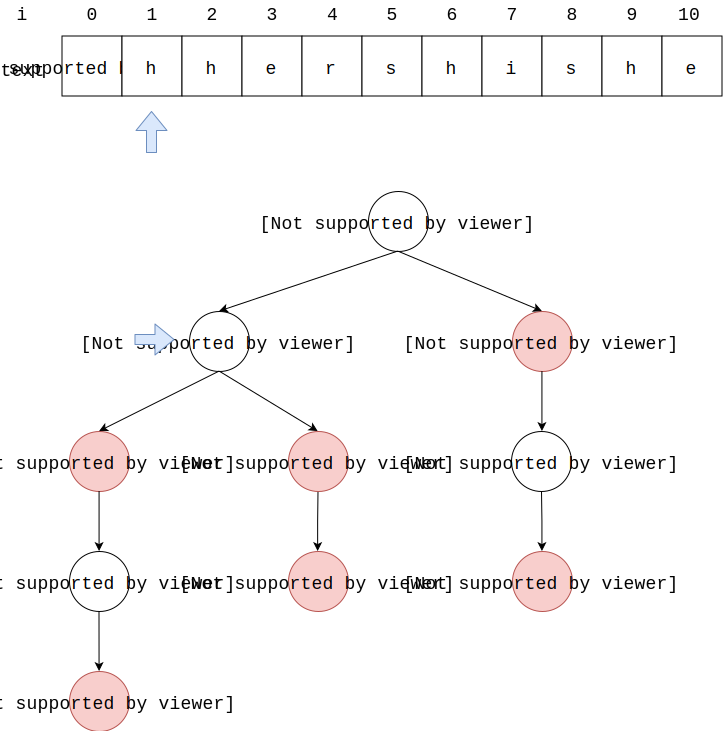
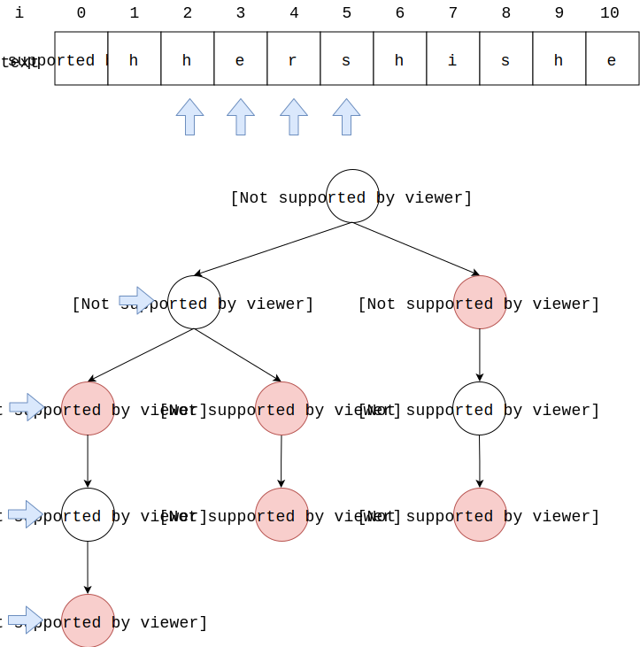
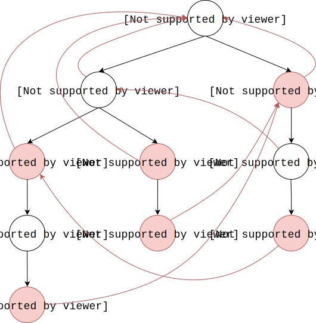

# Aho Corasick Automata - AC自动机

--------

#### 问题

在文本$$ text $$中查找$$ k $$个模式$$ pattern $$出现的所有位置（其中$$ text $$长度为$$ n $$，$$ pattern_{i} $$的长度为$$ m_{i} $$，其中最长的模式长度为$$ m_{max} $$且$$ n \gt m_{max} $$，所有模式长度之和为$$ m_{sum} = \sum_{i=1}^{k} m_{i} $$，且所有模式中的$$ pattern $$没有重复的字符串）。

#### 简单字符串匹配算法

将简单字符串匹配SimpleMatch应用在本问题上，搜索所有模式需要重复$$ k $$次，每次的时间复杂度为$$ O(n \cdot m_{i}) $$。直接应用SimpleMatch算法的时间复杂度为$$ O_{1} = O(n \cdot m_{sum}) $$。

#### 前缀树

我们能否在一次匹配$$ text $$的过程中就同时找出所有模式呢？即并行算法（算法上的并行，非多线程多进程的并行）。

首先用所有$$ pattern $$构造一个前缀树$$ pt $$，如图所示：

$$ (1) $$ 从$$ text $$的首个字符$$ text[i = 0] $$开始，将其与第一层以$$ pt[0] $$为根节点的孩子节点匹配，可知$$ text[0] = pt[1] $$，然后$$ i = i + 1 $$向右移动一位，$$ pt $$下一次匹配的位置以$$ pt[1] $$为根节点向下匹配；

$$ (2) $$ 从$$ text[i = 1] $$开始，将其与第二层以$$ pt[1] $$为根节点的孩子节点匹配，可知$$ text[1] = pt[5] $$。因$$ pt[5] $$为前缀树的终结点，则$$ "ab" $$在$$ text[0] $$处匹配成功。然后$$ i = i + 1 $$向右移动一位，$$ pt $$下一次匹配的位置是以$$ pt[5] $$为根节点向下匹配；

$$ (3) $$ 从$$ text[i = 2] $$开始，将其与第三层以$$ pt[5] $$为根节点的孩子节点匹配，可知$$ text[2] \ne pt[10] $$匹配失败。然后$$ i = i + 1 $$向右移动一位，$$ pt $$下一次匹配的位置回到根节点，以$$ pt[0] $$为根节点向下匹配；

$$

\cdots

$$

构建前缀树的时间复杂度为$$ O(m_{sum}) $$，之后对于文本上每个字符，都匹配一次前缀树即可，该算法的时间复杂度为$$ O_{2} = O(m_{sum}) + O(n \cdot max(m_{i})) $$。当$$ n $$远大于$$ max(m_{i}) $$时显然构造第二种算法更优。

#### 失败指针

考虑优化前缀树，如图所示：

$$ (1) $$ $$ text[0 \dots 3] $$与$$ pt[3 \dots 12] $$这一串完成匹配后，仔细观察可以发现，其实$$ text[1 \dots 4] = pt[2 \dots 11] $$；

$$ (2) $$ 在构造前缀树时我们已知$$ pt[2 \dots 9] = pt[7 \dots 12] $$，$$ pt[2 \dots 9] $$的长度为$$ 3 $$。那么我们可以从前缀树中字符串的末尾字符位置$$ pt[12] $$直接跳到$$ pt[9] $$。这时必然有$$ text[1 \dots 3] = pt[2 \dots 9] $$，继续向右匹配发现$$ text[4] = pt[11] $$，可知$$ text[1 \dots 4] = pt[2 \dots 11] $$。图中红色的连线称为失败链接/失败指针$$ failure link $$；

当文本匹配到前缀树中的$$ pt[i] $$字符时失败，这时我们尝试在前缀树中寻找$$ \alpha $$的最长后缀字符串$$ \beta $$（$$ pt[i] $$是$$ \alpha $$的末尾字符，$$ pt[j] $$是$$ \beta $$的末尾字符）。若找到这样一个合适的$$ \beta $$，建立从$$ pt[i] $$到$$ pt[j] $$的链接，否则建立从$$ pt[i] $$到$$ pt[root] $$的指针。显然前缀树中每个节点只有一个失败指针。失败指针的实质是后缀字符串，所以也称后缀链接/后缀指针$$ suffix link $$。

构造失败指针的核心在于匹配文本失败时，希望避免总是从前缀树的根部重新开始匹配。失败指针要么指向一个与当前位置上字符串相同的最长的后缀字符串（这样的指针就是后缀指针），要么指向前缀树的根节点。比如下图中$$ pt[2 \dots 9] = "oar" $$是$$ pt[3 \dots 12] = "soar" $$的后缀字符串，因此$$ pt[12] $$的失败指针指向$$ pt[9] $$。前缀树中找不到$$ pt[3 \dots 7] = "so" $$的最长后缀字符串（也可以认为最长后缀字符串为空），因此$$ pt[7] $$的失败指针指向$$ pt[root] $$。

失败指针将匹配的时间复杂度降低到$$ O_{3} = O(m_{sum}) + O(n) $$。

#### 输出指针

除了失败指针，考虑在前缀树上建立输出指针来优化，下图中蓝色线从节点$$ pt[i] $$指向节点$$ pt[j] $$，其中$$ pt[j] $$是前缀树中的字符串（红色节点）$$ \beta $$的末尾字符，设$$ pt[i] $$是字符串$$ \alpha $$的末尾字符，满足$$ \beta $$是$$ \alpha $$的后缀字符串，但不必是最长的。

显然在匹配时，若前缀树的当前节点上有输出指针，可以立刻直接沿着输出指针找到一个不在当前字符串上（在其他分支的字符串上）的成功匹配。前缀树上每个指针可以有多个输出指针，当一个节点上有输出指针时，我们使用所有的输出指针，找到所有在其他分支的字符串上的所有成功匹配。

最终得到AC自动机算法：对于文本$$ text $$上的任意字符$$ text[i] $$，从前缀树$$ pt $$的根部开始匹配：

$$ (1) $$ 沿着前缀树完成一次成功匹配，$$ text[i] $$上的位置$$ i $$向右移动一位，从前缀树$$ pt $$的根节点重新开始匹配；

$$ (2) $$ 在匹配中途失败，若前缀树上的当前节点上有失败指针，则跳到失败指针处继续匹配，因为失败指针所处的字符串是原位置上字符串的后缀字符串，所以原位置上字符串成功匹配的部分仍然成功，我们直接跳过这些成功匹配的部分，只要继续剩下部分的匹配，尝试到达前缀树的终点即可；

$$ (3) $$ 匹配中途遇到的任何输出指针，都立刻沿着输出指针找到一次不在当前字符串上（在其他分支字符串上）的成功匹配；

AC自动机算法的时间复杂度为$$ O(n + m_{sum} + z) $$。其中$$ z $$是所有模式$$ pattern $$在文本$$ text $$上出现的次数。

#### 构建AC自动机

构建AC自动机需要三步：构建前缀树；构建失败指针；构建输出指针。

构造前缀树的过程详见本书的DataStructure-PrefixTree。

构造失败指针的过程是一种BFS算法。初始时令所有节点的失败指针为空，首先将前缀树的根节点加入空队列$$ Queue $$中。然后每次从$$ Queue $$中取出头节点，并将其所有孩子节点推入$$ Queue $$中，对于每个取出的节点进行如下操作：

$$ (1) $$ 对于前缀树根节点$$ pt[root] $$，其失败指针为空；

$$ (2) $$ 对于前缀树第一层节点，其失败指针指向$$ pt[root] $$；

$$ (3) $$ 对于前缀树中其他的节点$$ pt[i] $$，设该节点的字符为$$ x $$，其父节点为$$ pt[father] $$，且$$ pt[j] $$为$$ pt[father] $$的失败指针。若$$ pt[j] $$有字符为$$ x $$的孩子节点$$ pt[child] $$，则显然$$ pt[child] $$所在的字符串为$$ pt[i] $$所在字符串的最长后缀字符串。因此$$ pt[i] $$的失败指针指向$$ pt[child] $$。若不存在这样的孩子节点，则递归的再考虑$$ pt[j] $$的失败指针，直到失败指针本身是$$ pt[root] $$，则将$$ pt[i] $$的失败指针指向$$ pt[root] $$，递归结束；

构造输出指针的过程，是在构造失败指针的同时完成的。初始时令所有节点的输出指针为空，在BFS遍历前缀树上所有节点的过程中：

$$ (1) $$ 前缀树根节点$$ pt[root] $$没有输出指针；

$$ (2) $$ 对于前缀树中其他的节点$$ pt[i] $$，设其失败指针指向$$ pt[j] $$节点，若以$$ pt[j] $$为末尾字符的字符串刚好等于所有模式$$ pattern $$中的某个，则$$ pt[i] $$上存在一个输出指针指向$$ pt[j] $$。否则$$ pt[i] $$的输出指针指向$$ pt[j] $$的输出指针指向的节点；

--------

#### Aho Corasick Automata

* https://web.stanford.edu/class/cs166/lectures/02/Small02.pdf
* https://www.geeksforgeeks.org/aho-corasick-algorithm-pattern-searching/
* http://www.learn4master.com/algorithms/aho-corasick-algorithm
* http://101.96.10.64/u.cs.biu.ac.il/~amir/PMslides/pattern_matching_lecture_notes_1.pdf

--------

#### 源码

[import, lang:"c_cpp"](../../../src/TextMatch/AhoCorasickAutomata.h)

#### 测试

[import, lang:"c_cpp"](../../../src/TextMatch/AhoCorasickAutomata.cpp)
